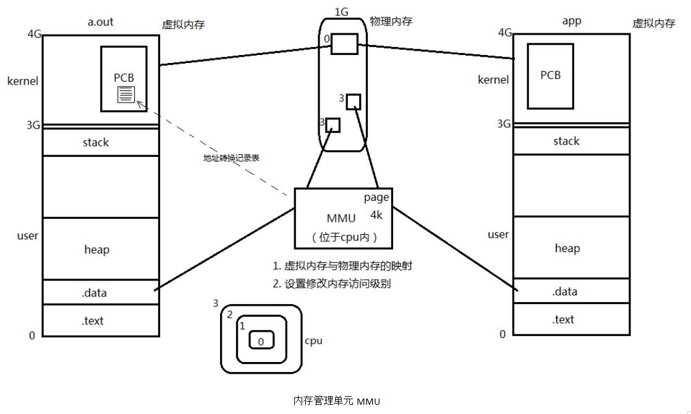
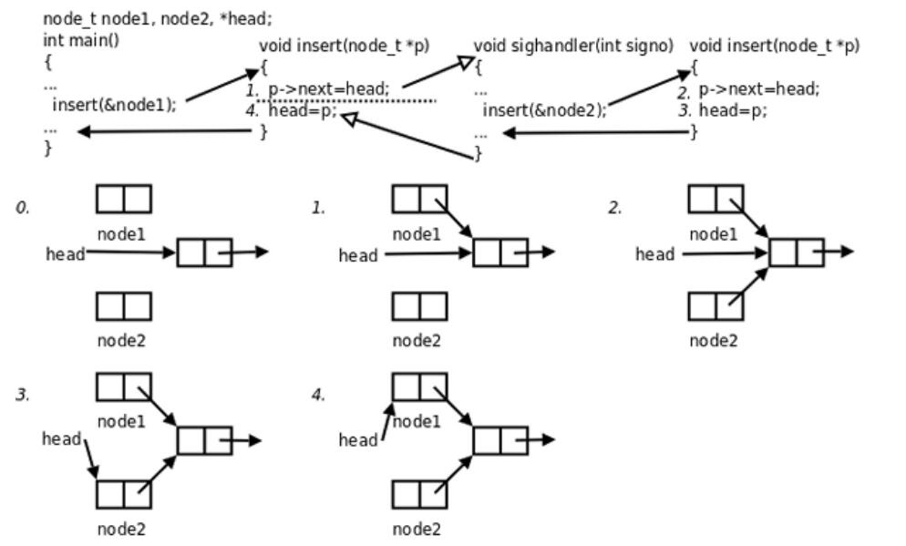
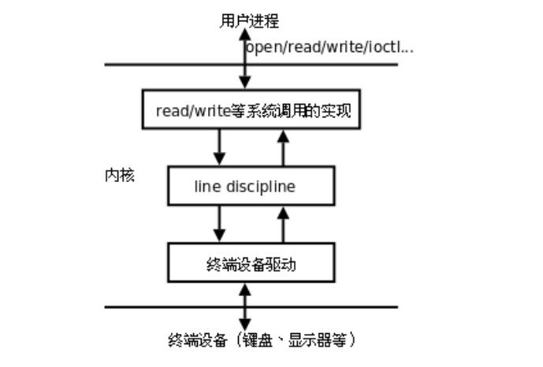
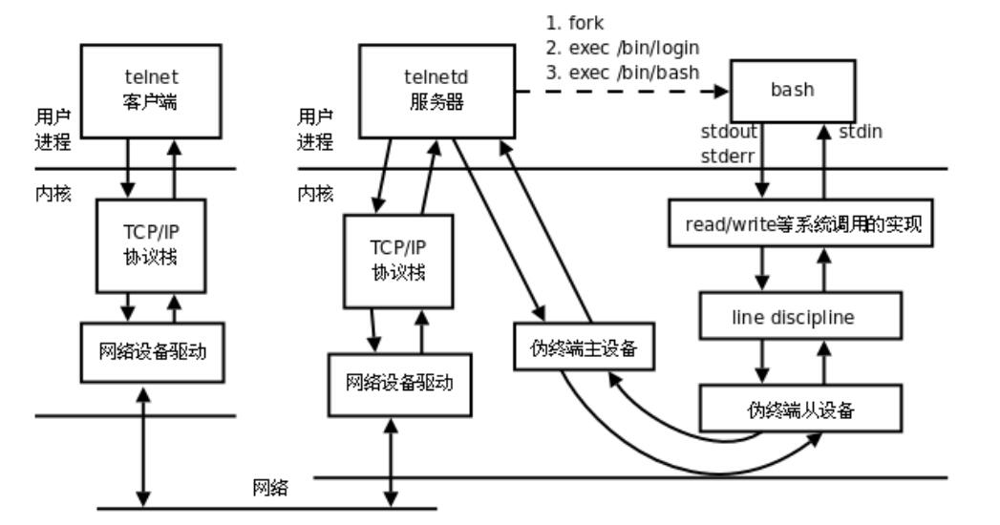

## 1. 基本概念

**程序**，指编译好的二进制文件，存在磁盘上，不占用系统资源（cpu、内存、打开的文件、设备、锁...）。

**进程**，是一个抽象概念，与操作系统相关，进程时活跃的程序，占用系统资源，在内存中运行。程序运行起来产生一个进程。

同一个程序加载成不同的进程，彼此互不影响。

**并发**

并发，在操作系统中，一个时间段中有多个进程都处于已启动运行到运行完毕之间的状态。但，任一个时刻点上仍只有一个进程在运行

**单道程序设计**

所有进程一个一个排对执行。若A阻塞，B只能等待，即使CPU处于空闲状态。而在人机交互时阻塞的出现时必然的。所有这种模型在系统资源利用上及其不合理，在计算机发展历史上存在不久，大部分便被淘汰了。


**多道程序设计**

在计算机内存中同时存放几道相互独立的程序，它们在管理程序控制之下，相互穿插的运行。多道程序设计必须有硬件基础作为保证。

时钟中断即为多道程序设计模型的理论基础。 并发时，任意进程在执行期间都不希望放弃cpu。因此系统需要一种强制让进程让出cpu资源的手段。时钟中断有硬件基础作为保障，对进程而言不可抗拒。 操作系统中的中断处理函数，来负责调度程序执行。

在多道程序设计模型中，多个进程轮流使用CPU (分时复用CPU资源)。而当下常见CPU为纳秒级，1秒可以执行大约10亿条指令。由于人眼的反应速度是毫秒级，所以看似同时在运行。

1s = 1000ms, 1ms = 1000us, 1us = 1000ns   1000000000 

实质上，并发是宏观并行，微观串行！			-----推动了计算机蓬勃发展，将人类引入了多媒体时代。

**cpu和mmu**


代码通过预处理、编译、汇编、链接之后生成程序，cpu中的预取器每次取一条指令，然后译码器分析做处理。




虚拟地址空间是可用的地址空间（4G）

MMU的作用

- 虚拟地址和物理内存的映射

- 设置内存访问级别

  CPU分为4种访问级别，linux实际用到两种0和3，分别对应内核区和用户区。

MMU划分内存的最小单元是一个页面4K.

不同进程的PCB位于同一个物理内存中，但是他们的PCB不相同。


**进程控制块 PCB**

每个进程在内核中都有一个进程控制块（PCB）来维护进程相关的信息，Linux内核的进程控制块是task_struct结构体。

/usr/src/linux-headers-3.16.0-30/include/linux/sched.h文件中可以查看struct task_struct 结构体定义。其内部成员有很多，我们重点掌握以下部分即可：

- 进程id。系统中每个进程有唯一的id，在C语言中用pid_t类型表示，其实就是一个非负整数。

- 进程的状态，有就绪、运行、挂起、停止等状态。

- 进程切换时需要保存和恢复的一些CPU寄存器信息。

- 描述虚拟地址空间的信息。

- 描述控制终端的信息。

- 当前工作目录。

- umask掩码。

* 文件描述符表，包含很多指向file结构体的指针。

- 和信号相关的信息。

- 用户id和组id。
- 会话（Session）和进程组。
- 进程可以使用的资源上限（Resource Limit）。

**进程状态**

进程基本的状态有5种。分别为**初始态，就绪态，运行态，挂起态**与**终止态**。其中初始态为进程准备阶段，常与就绪态结合来看。


## 2. 环境变量

linux是多用户多任务的开源操作系统，多任务是并发，多用户是支持多个用户同时登录系统，每个用户就对应一个环境变量，保存用户的一些习惯。

环境变量，是指在操作系统中用来指定操作系统运行环境的一些参数。通常具备以下特征：

- 字符串(本质) 
- 有统一的格式：名=值[:值] 
-  值用来描述进程环境信息

存储形式：与命令行参数类似。char *[]数组，数组名environ，内部存储字符串，NULL作为哨兵结尾。

使用形式：与命令行参数类似。

加载位置：与命令行参数类似。位于用户区，高于stack的起始位置。

引入环境变量表：须声明环境变量。extern char ** environ;		

​	

**PATH**

可执行文件的搜索路径。ls命令也是一个程序，执行它不需要提供完整的路径名/bin/ls，然而通常我们执行当前目录下的程序a.out却需要提供完整的路径名./a.out，这是因为PATH环境变量的值里面包含了ls命令所在的目录/bin，却不包含a.out所在的目录。PATH环境变量的值可以包含多个目录，用:号隔开。

查看环境变量的值：

```bash
echo $PATH
```


**SHELL**

当前Shell，它的值通常是/bin/bash。


**TERM**

当前终端类型，在图形界面终端下它的值通常是xterm，终端类型决定了一些程序的输出显示方式，比如图形界面终端可以显示汉字，而字符终端一般不行。


**LANG**

语言和locale，决定了字符编码以及时间、货币等信息的显示格式。


**HOME**

当前用户主目录的路径，很多程序需要在主目录下保存配置文件，使得每个用户在运行该程序时都有自己的一套配置。


### environ

引入环境变量表：须声明环境变量。extern char ** environ;		

存储形式：与命令行参数类似。char *[]数组，数组名environ，内部存储字符串，NULL作为哨兵结尾。

```c
extern char **environ;

for (int i = 0; environ[i]; ++i) {
    printf("%s\n", environ[i]);
}
```

### getenv

getenv获取环境变量

```cpp
#include <stdlib.h>

char *getenv(const char *name);
```

返回值

```
NULL	不匹配
指针	   成功，返回对应的value
```


### setenv/unsetenv

setenv设置环境变量，unsetenv取消设置。

```cpp
#include <stdlib.h>

int setenv(const char *name, const char *value, int overwrite);
int unsetenv(const char *name);
```

返回值

```
-1	失败，并设置errno
0	成功
```

setenv当环境变量存在，如果overwrite非0则覆盖，否则不覆盖。

unsetenv删除一个不存在的环境变量不会报错，但是如果格式不对会报错（XXX=）。

```c
#include <stdio.h>
#include <stdlib.h>
#include <string.h>
#include <stdio.h>

int main(void)
{
	char *val;
	const char *name = "ABD";

	val = getenv(name);
	printf("1, %s = %s\n", name, val);

	setenv(name, "haha-day-and-night", 1);

	val = getenv(name);
	printf("2, %s = %s\n", name, val);

#if 1
	int ret = unsetenv("ABD=");
    printf("ret = %d\n", ret);
	perror("unsetenv");

	val = getenv(name);
	printf("3, %s = %s\n", name, val);

#else
	int ret = unsetenv("ABD");  //name=value:value
	printf("ret = %d\n", ret);

	val = getenv(name);
	printf("3, %s = %s\n", name, val);

#endif

	return 0;
}
```


## 3. 进程控制原语

### fork

[fork底层实现](https://www.cnblogs.com/tp-16b/p/9005079.html)

```cpp
#include <sys/types.h>
#include <unistd.h>
       
pid_t fork(void);
```

fork有两个返回值，分别对应父进程和子进程。

```
-1		失败，并设置errno
>0 		父进程返回子进程的PID
0		子进程返回0
```

父子进程顺序由内核调度算法决定。

父子进程相同：全局变量、.data、.text、堆、栈、环境变量、用户ID、宿主目录、进程工作目录、信号处理方式。

父子进程不同：进程ID、for返回值、父进程ID、进程运行时间、定时器、未决信号集。

看似是子进程复制了父进程0-3G的用户空间的内容，以及父进程的PCB，但pdi不同。实际上fork一个子进程并不是将0-3G地址空间完全拷贝一份，然后映射到物理内存，而是采用**读时共享, 写时复制**的原则，这样可以节省内存的开销。

父子进程共享：文件描述符、mmap建立的映射区。

```c
// 创建多个进程
#include <stdio.h>
#include <unistd.h>
#include <stdlib.h>

int main(int argc, char *argv[])
{
	int n = 5, i;				//默认创建5个子进程

	if(argc == 2){	
		n = atoi(argv[1]);
	}

	for(i = 0; i < n; i++)	//出口1,父进程专用出口
		if (fork() == 0)
			break;			//出口2,子进程出口,i不自增
        if (n == i){
            sleep(n);
            printf("I am parent, pid = %d\n", getpid());
        }else {
            sleep(i);
            printf("I'm %dth child, pid = %d\n", i+1, getpid());
        }

	return 0;
}
```


### 线程调用fork

**子线程中执行fork，只复制调用fork的线程，不会复制其他的线程**

```c
#include <pthread.h>
#include <unistd.h>
#include <stdio.h>
#include <sys/types.h>


int i = 0;

void* func(void *arg) {
	while(1) {
		printf("%d\n", i);
		sleep(1);
	}
}

int main()
{

	pid_t pid;
	pthread_t ppid;
	pthread_create(&ppid, NULL, &func, NULL);
	
	// 子进程修改i
	if ((pid = fork()) == 0) { 		
		i = 1;
	}

	while(1);
	
	return 0;
}

```


```c
// test2.c
#include <pthread.h>
#include <sys/syscall.h>
#include <unistd.h>
#include <stdio.h>
#include <sys/types.h>


int i = 0;

void* func(void *arg) {
	pid_t pid;
	if ((pid = fork()) == 0) {
		i = 1;
	}
	while(1) {
		printf("pid = %d, tid = %ld, %d\n", getpid(), syscall(__NR_gettid), i);
		sleep(1);
	}
}

int main()
{

	pid_t pid;
	pthread_t ppid;
	pthread_create(&ppid, NULL, &func, NULL);
	
	while(1) {
		printf("main\n");
		sleep(1);
	};
	
	return 0;
}
```


### getpid/getppid

获取进程PID和父进程的PID

```cpp
#include <sys/types.h>
#include <unistd.h>

pid_t getpid(void);
pid_t getppid(void);
```

### getuid

获取用户ID。

```cpp
#include <unistd.h>
#include <sys/types.h>

uid_t getuid(void);
```


### getgid

获取用户组ID。

```cpp
#include <unistd.h>
#include <sys/types.h>

gid_t getgid(void);
```


### exec

fork创建子进程，在调用exec函数之后，子进程的PID不变，子进程会执行调用的程序。

|                 |                        |
| --------------- | ---------------------- |
| l（list）       | 命令行参数             |
| p（path）       | 搜索file时使用path变量 |
| v（vector）     | 使用命令行参数数组     |
| e（environment) | 使用环境变量数组       |


```
#include <unistd.h>
extern char **environ;

int execl(const char *path, const char *arg, .../* (char  *) NULL */);
int execlp(const char *file, const char *arg, .../* (char  *) NULL */);
int execle(const char *path, const char *arg, .../*, (char *) NULL, char * const envp[] */);
int execv(const char *path, char *const argv[]);
int execvp(const char *file, char *const argv[]);
int execvpe(const char *file, char *const argv[],
char *const envp[]);

```

```
exec函数只会在出错时返回-1，并设置error
```


- execlp, 借助PATH环境变量加载新程序。
- execl, 通过路径+程序名加载进程

```c
#include <stdio.h>
#include <unistd.h>

int main() {
    pid_t pid;
    pid = fork();

    if (pid == -1) {
        perror("fork");
        exit(1);
    }else if (pid > 0) {
        sleep(2); 
        printf("I am father\n");
    }else {
        // execlp("ls", "ls", "-l", "-a", NULL);
        // execl("/bin/ls", "ls", "-l", "-a", NULL);
        char *argv[] = {"ls", "-l", "-a", NULL};
        execv("/bin/ls", argv);
    }
    return 0;
}
```

```cpp
// 利用dup2实现exec输出到文件中
#include <stdio.h>
#include <unistd.h>
#include <fcntl.h>
#include <stdlib.h>

int main() {
    int fd;
    fd = open("ps.log", O_CREAT | O_WRONLY | O_TRUNC, 06444);
    if (fd < 0) {
        perror("open");
        exit(1);
    }

    pid_t pid = fork();
    if (pid == -1) {
        perror("fork");
        exit(1);
    }else if (pid > 0) {
        sleep(1);
        printf("I am father\n");
    }else {
        dup2(fd, 1);
        execlp("ps", "ps", "-aux", NULL);
    }

    return 0;
}
```


### 孤儿/僵尸进程

**孤儿进程**：父进程先于子进程结束，则子进程称为孤儿进程，子进程的父进程成为init进程，init进程领养孤儿进程。

**僵尸进程**：进程终止，父进程尚未回收，子进程残留资源（PCB）存放在内核中，方便父进程收尸，如果父进程不回收就变成了僵尸进程。


### wait

```cpp
#include <sys/types.h>
#include <sys/wait.h>

pid_t wait(int *wstatus);
```

```
>0	成功，子进程PID
-1	失败
```

父进程调用wait函数可以回收子进程终止信息：

- 阻塞等待子进程退出
- 回收子进程残留资源
- 获取子进程退出状态（退出原因）

多个子进程, 只能回收一个。

```c
// 正常退出
pid_t pid, wpid;
int status;

wpid = wait(&status);
printf("wpid = %d\n", wpid);
if (wpid == -1) {
    perror("wait");
    exit(1);
}

if (WIFEXITED(status)) { // 正常退出
    // 获取退出值，对应子进程exit退出的值
    printf("child exit with %d\n", WEXITSTATUS(status));
}

if (WIFSIGNALED(status)) { // 非正常退出
    // 获取异常退出的信号
    printf("child killed by %d\n", WTERMSIG(status));
}
```


### waitpid

为指定进程收尸。

```cpp
#include <sys/types.h>
#include <sys/wait.h>

pid_t waitpid(pid_t pid, int *wstatus, int options);
```

```
-1	失败
>0 	成功，子进程的PID
0	非阻塞回收失败返回0
```

| pid  |                            |
| ---- | -------------------------- |
| > 0  | 回收指定pid的子进程        |
| -1   | 回收任意子进程（wait）     |
| 0    | 回收本组任意子进程         |
| < -1 | 回收指定进程组的任意子进程 |

| options |        |
| ------- | ------ |
| 0       | 阻塞   |
| WHOHANG | 非阻塞 |


```c
// 阻塞回收所有进程
while ((wpid = waitpid(-1, NULL, 0)) > 0) { // 等价于 wait(NULL)
    printf("child pid = %d exit\n", wpid);
}
        
// 轮训回收所有的子进程
int cnt = 0;
do {
    wpid = waitpid(-1, NULL, WNOHANG);
    if (wpid > 0) {
        printf("child pid = %d exit\n", wpid);
        cnt++;
    }
    // 参数为WNOHANG且子进程没有退出, 返回0
    sleep(1);
}while (cnt != 3);
```


## 4. 时序竞态

竞态条件，跟系统负载有很紧密的关系，体现出信号的不可靠性。系统负载越严重，信号不可靠性越强。

不可靠由其实现原理所致。信号是通过软件方式实现(跟内核调度高度依赖，延时性强)，每次系统调用结束后，或中断处理处理结束后，需通过扫描PCB中的未决信号集，来判断是否应处理某个信号。当系统负载过重时，会出现时序混乱。

这种意外情况只能在编写程序过程中，提早预见，主动规避，而无法通过gdb程序调试等其他手段弥补。且由于该错误不具规律性，后期捕捉和重现十分困难。


### pause

调用该函数可以造成进程主动挂起，等待信号唤醒。调用该系统调用的进程将处于阻塞状态(主动放弃cpu) 直到有信号递达将其唤醒，需要注册捕捉函数。

```cpp
#include <unistd.h>

int pause(void);
```

只有当信号捕捉的时候会返回，然后返回-1，设置errno为EINTR。

```c
/* 	
 	pause.c
	alarm + pause 实现sleep, 存在时序竞态的问题
*/
#include <stdio.h>
#include <stdio.h>
#include <unistd.h>
#include <signal.h>
#include <errno.h>

void docatch(int signo) {
    return;
}

unsigned int mysleep(unsigned int seconds) {
    struct sigaction act, oldact;
    act.sa_handler = docatch;
    sigemptyset(&act.sa_mask);
    act.sa_flags = 0;

    sigaction(SIGALRM, &act, &oldact);
    alarm(seconds);
    int ret = pause(); // 主动挂起 等待信号
    if (ret == -1 && errno == EINTR) {
        printf("pause sucess\n");
    }
    
    ret = alarm(0); // 清空定时器
    sigaction(SIGALRM, &oldact, NULL); // 恢复SIGALRM的默认处理方式

    return ret;
}
int main() {
    while (1) {
        mysleep(2);
        printf("----------------\n");
    }
    return 0;
}
```

如果程序在alarm之后失去cpu, alarm的计时不会停止, 当进程重新获取cpu之后，内核首先会处理到时触发的alarm信号, 之后的pause就不能被设置ALARM唤醒。

一个解决的方法就是在alarm调用之后，对SIGARM信号进行屏蔽，然后在合适的实际进行解除屏蔽，但是无论如何设置都有可能在alarm和pause中间时刻，失去CPU。这就是时序竞态问题。

Linux提供了另外一个函数sigsuspend，它可以将屏蔽信号和挂起程序进行绑定，形成一个原子操作。


### sigsuspend

sigsuspend作用和pause作用类似，都是挂起进程，等待信号唤醒。通过设置mask可以使sigsuspend在挂起的使用一个临时的阻塞信号集进行处理，在sigsuspend返回之后，恢复之前的阻塞信号集。

所以整个的过程是：

- 首先通过sigprocmask设置目标信号的阻塞信号集newmask，同时拿到之前的阻塞信号集oldmask。
- 然后设施sigsuspend的mask，将oldmask中指定的屏蔽信号删除，这样在挂起期间，就可以对之前阻塞的信号进行处理。
- 当sigsuspend成功返回之后，自动恢复之前设置的阻塞信号集的状态newmask。
- 最后通过sigaction恢复对目标信号的默认处理方式，并通过sigprocmask来恢复进程初始的oldmask。


```cpp
#include <signal.h>

int sigsuspend(const sigset_t *mask);
```
总是返回值-1，并设置errno，正常情况下errno为EINTR。

```c
// sigsuspend.c
#include <stdio.h>
#include <stdio.h>
#include <unistd.h>
#include <signal.h>
#include <errno.h>

void docatch(int signo) {
    return;
}

unsigned int mysleep(unsigned int seconds) {
    sigset_t newmask, oldmask, suspmask;
    struct sigaction act, oldact;
    unsigned int unslept;

    // 为SIGALRM设置捕捉函数
    act.sa_handler = docatch;
    sigemptyset(&act.sa_mask);
    act.sa_flags = 0;
    sigaction(SIGALRM, &act, &oldact);

    // 设置阻塞信号集, 阻塞SIGALRM
    sigemptyset(&newmask);
    sigaddset(&newmask, SIGALRM);
    sigprocmask(SIG_BLOCK, &newmask, &oldmask);

    // 启动定时
    alarm(seconds);

    // 调用sigsuspend, 使用临时有效的阻塞信号集
    // 在临时阻塞集合中解除SIGALRM信号的阻塞
    // sigsuspend完成之后, 恢复之前的阻塞信号集
    suspmask = oldmask;
    sigdelset(&suspmask, SIGALRM); // 删除对SIGALRM的屏蔽
    sigsuspend(&suspmask); // 原子操作

    unslept = alarm(0);
    // 恢复SIGALRM原有的处理动作
    sigaction(SIGALRM, &oldact, NULL);
    // 解除对SIGALRM的阻塞, 恢复之前的阻塞信号集
    sigprocmask(SIG_SETMASK, &oldmask, NULL);
    
    return unslept;
}
int main() {
    while (1) {
        mysleep(2);
        printf("----------------\n");
    }
    return 0;
}
```


### 全局变量的异步IO

父子进程通过信号来进行数数，中间通过设置全局变量父子进程分别判断是否已经数过数。

```c
// sync_process.c
#include <stdio.h>
#include <stdlib.h>
#include <unistd.h>
#include <signal.h>

int n = 0, flag = 0;

void sys_err(char *str) {
    perror(str);
    exit(1);
}

void do_sigchild(int signo) {
    printf("I am child %d\t%d\n", getpid(), n);
    n += 2;
    flag = 1;
//    sleep(1);
}

void do_sigparent(int signo) {
    printf("I am parent %d\t%d\n", getpid(), n);
    n += 2;
    flag = 1;
//    sleep(1);
}

int main() {
    pid_t pid;
    struct sigaction act;
    if ((pid = fork()) < 0) {
        sys_err("fork");
    }else if (pid > 0) { 
        n = 1;
        sleep(1);
        act.sa_handler = do_sigparent;
        sigemptyset(&act.sa_mask);
        act.sa_flags = 0;
        sigaction(SIGUSR2, &act, NULL);
        do_sigparent(0);
        while (1) {
            if (flag == 1) {
                kill(pid, SIGUSR1);
                // -----------失去CPU-----------
                flag = 0; // flag的值前后可能存在时序竞态错误
            }
        }
    }else if(pid == 0){
        n = 2;
        act.sa_handler = do_sigchild;
        sigemptyset(&act.sa_mask);
        act.sa_flags = 0;
        sigaction(SIGUSR1, &act, NULL);
        while (1) {
            if (flag == 1) {
                kill(getppid(), SIGUSR2);
                flag = 0; 
            }
        }
    }
    return 0;
}
```

这样可能会存在问题，当父进程kill发送信号给子进程之后失去CPU，子进程正常处理，像父进程发送信号，这时父进程得到CPU之后先处理信号执行捕捉函数，然后接着之前中断的代码进行处理，这时将flag置为0，父进程就会陷入死循环，同时子进程也不会收到父进程的信号了。

解决的方法就是，涉及到多个地方访问全局变量的时候，尽量不使用全局变量，使用局部变量，对于上面的例子，可以是在回调函数数完数之后发送信号。

如果一定要用全局变量，可以使用锁去维护秩序。


### 可/不可重入函数

一个函数在被调用执行期间(尚未调用结束)，由于某种时序又被重复调用，称之为“重入”。根据函数实现的方法可分为“可重入函数”和“不可重入函数”两种。看如下时序。

在执行头插链表的中间发送中断，在信号捕捉函数中同样执行头插，在中断处理结束回到之前中断的代码继续执行，这时head的指向就会出现问题。

显然，insert函数是不可重入函数，重入调用，会导致意外结果呈现。究其原因，是该函数内部实现使用了全局变量。



1. 定义可重入函数，函数内不能含有全局变量及static变量，不能使用malloc、free

2. 信号捕捉函数应设计为可重入函数

3. 信号处理程序可以调用的可重入函数可参阅man 7 signal 

4. 没有包含在上述列表中的函数大多是不可重入的，其原因为：
   - 使用静态数据结构
   - 调用了malloc或free
   - 是标准I/O函数


## 5. 信号中断系统调用

系统调用可分为两类：慢速系统调用和其他系统调用。

1. 慢速系统调用：可能会使进程永远阻塞的一类。如果在阻塞期间收到一个信号，该系统调用就被中断,不再继续执行(早期)；也可以设定系统调用是否重启。如，read、write、pause、wait...

2. 其他系统调用：getpid、getppid、fork...

结合pause，回顾慢速系统调用：

慢速系统调用被中断的相关行为，实际上就是pause的行为： 如，read

- 想中断pause，信号不能被屏蔽。
- 信号的处理方式必须是捕捉 (默认、忽略都不可以)
- 中断后返回-1， 设置errno为EINTR(表“被信号中断”)

可修改sa_flags参数来设置被信号中断后系统调用是否重启。SA_INTERRURT不重启。 SA_RESTART重启。

扩展了解：sa_flags还有很多可选参数，适用于不同情况。如：捕捉到信号后，在执行捕捉函数期间，不希望自动阻塞该信号，可将sa_flags设置为SA_NODEFER，除非sa_mask中包含该信号。


## 6. 终端

在UNIX系统中，用户通过终端登录系统后得到一个Shell进程，这个终端成为Shell进程的控制终端（Controlling Terminal），进程中，控制终端是保存在PCB中的信息，而fork会复制PCB中的信息，因此由Shell进程启动的其它进程的控制终端也是这个终端。默认情况下（没有重定向），每个进程的标准输入、标准输出和标准错误输出都指向控制终端，进程从标准输入读也就是读用户的键盘输入，进程往标准输出或标准错误输出写也就是输出到显示器上。信号中还讲过，在控制终端输入一些特殊的控制键可以给前台进程发信号，例如Ctrl-C表示SIGINT，Ctrl-\表示SIGQUIT。

Alt + Ctrl + F1、F2、F3、F4、F5、F6	字符终端  pts (pseudo terminal slave) 指伪终端。

Alt + F7		图形终端

SSH、Telnet...		网络终端

### 终端的启动流程

文件与I/O中讲过，每个进程都可以通过一个特殊的设备文件/dev/tty访问它的控制终端。事实上每个终端设备都对应一个不同的设备文件，/dev/tty提供了一个通用的接口，一个进程要访问它的控制终端既可以通过/dev/tty也可以通过该终端设备所对应的设备文件来访问。ttyname函数可以由文件描述符查出对应的文件名，该文件描述符必须指向一个终端设备而不能是任意文件。

简单来说，一个Linux系统启动，大致经历如下的步骤：

​	init --> fork --> exec --> getty --> 用户输入帐号 --> login --> 输入密码 --> exec --> bash

硬件驱动程序负责读写实际的硬件设备，比如从键盘读入字符和把字符输出到显示器，**线路规程**像一个过滤器，对于某些特殊字符并不是让它直接通过，而是做特殊处理，比如在键盘上按下Ctrl-z，对应的字符并不会被用户程序的read读到，而是被线路规程截获，解释成SIGTSTP信号发给前台进程，通常会使该进程停止。线路规程应该过滤哪些字符和做哪些特殊处理是可以配置的。



### 网络终端

虚拟终端或串口终端的数目是有限的，虚拟终端(字符控制终端)一般就是/dev/tty1∼/dev/tty6六个，串口终端的数目也不超过串口的数目。然而网络终端或图形终端窗口的数目却是不受限制的，这是通过伪终端（Pseudo TTY）实现的。一套伪终端由一个**主设备**（PTY Master）和一个**从设备**（PTY Slave）组成。主设备在概念上相当于键盘和显示器，只不过它不是真正的硬件而是一个内核模块，操作它的也不是用户而是另外一个进程。从设备和上面介绍的/dev/tty1这样的终端设备模块类似，只不过它的底层驱动程序不是访问硬件而是访问主设备。网络终端或图形终端窗口的Shell进程以及它启动的其它进程都会认为自己的控制终端是伪终端从设备，例如/dev/pts/0、/dev/pts/1等。下面以telnet为例说明网络登录和使用伪终端的过程。



TCP/IP协议栈：在数据包上添加报头。

如果telnet客户端和服务器之间的网络延迟较大，我们会观察到按下一个键之后要过几秒钟才能回显到屏幕上。这说明我们每按一个键telnet客户端都会立刻把该字符发送给服务器，然后这个字符经过伪终端主设备和从设备之后被Shell进程读取，同时回显到伪终端从设备，回显的字符再经过伪终端主设备、telnetd服务器和网络发回给telnet客户端，显示给用户看。也许你会觉得吃惊，但真的是这样：每按一个键都要在网络上走个来回！


## 7. 进程组

进程组，也称之为作业。BSD于1980年前后向Unix中增加的一个新特性。代表一个或多个进程的集合。每个进程都属于一个进程组。在waitpid函数和kill函数的参数中都曾使用到。操作系统设计的进程组的概念，是为了简化对多个进程的管理。

当父进程，创建子进程的时候，默认子进程与父进程属于同一进程组。进程组ID\==第一个进程ID(组长进程)。所以，组长进程标识：其进程组ID\==其进程ID 

可以使用kill -SIGKILL -进程组ID(负的)来将整个进程组内的进程全部杀死。			【kill_multprocess.c】

组长进程可以创建一个进程组，创建该进程组中的进程，然后终止。只要进程组中有一个进程存在，进程组就存在，与组长进程是否终止无关。

进程组生存期：进程组创建到最后一个进程离开(终止或转移到另一个进程组)。

一个进程可以为自己或子进程设置进程组ID

```cpp
#include <sys/types.h>
#include <unistd.h>

pid_t getpgid(pid_t pid); 			// 获取指定进程组id，pid=0放回本进程组id
pid_t getpgrp(void);       			// 获取本进程组id
int setpgid(pid_t pid, pid_t pgid);	// 设置进程组id
```

```
-1 	失败，并设置errno
0	成功
```


## 8. 会话

创建一个会话需要注意以下6点注意事项：

1. 调用进程不能是进程组组长，该进程变成新会话首进程(session header)

2. 该进程成为一个新进程组的组长进程。

3. 需有root权限(ubuntu不需要)

4. 新会话丢弃原有的控制终端，该会话没有控制终端

5. 该调用进程是组长进程，则出错返回

6. 建立新会话时，先调用fork, 父进程终止，子进程调用setsid

```cpp
#include <sys/types.h>
#include <unistd.h>

pid_t getsid(pid_t pid);
pid_t setsid(void);
```

```
-1		失败，并设置errno
会话id   成功
```


## 9. 守护进程

Daemon(精灵)进程，是Linux中的后台服务进程，通常独立于控制终端并且周期性地执行某种任务或等待处理某些发生的事件。一般采用以d结尾的名字。

Linux后台的一些系统服务进程，没有控制终端，不能直接和用户交互。不受用户登录、注销的影响，一直在运行着，他们都是守护进程。如：预读入缓输出机制的实现；ftp服务器；nfs服务器等。

创建守护进程，最关键的一步是调用setsid函数创建一个新的Session，并成为Session Leader。

1. 创建子进程，父进程退出，所有工作在子进程中进行形式上脱离了控制终端。

2. 在子进程中创建新会话，setsid()函数，使子进程完全独立出来，脱离控制。

3. 改变当前目录为根目录，chdir()函数，防止占用可卸载的文件系统，也可以换成其它路径。

4. 重设文件权限掩码，umask()函数，防止继承的文件创建屏蔽字拒绝某些权限，增加守护进程灵活性。

　　	防止继承的文件创建屏蔽字拒绝某些权限

5. 关闭文件描述符，继承的打开文件不会用到，浪费系统资源，无法卸载。

6. 开始执行守护进程核心工作

7. 退出守护进程

可以将守护进程添加到`.bashrc`中，随shell一起加载启动。

