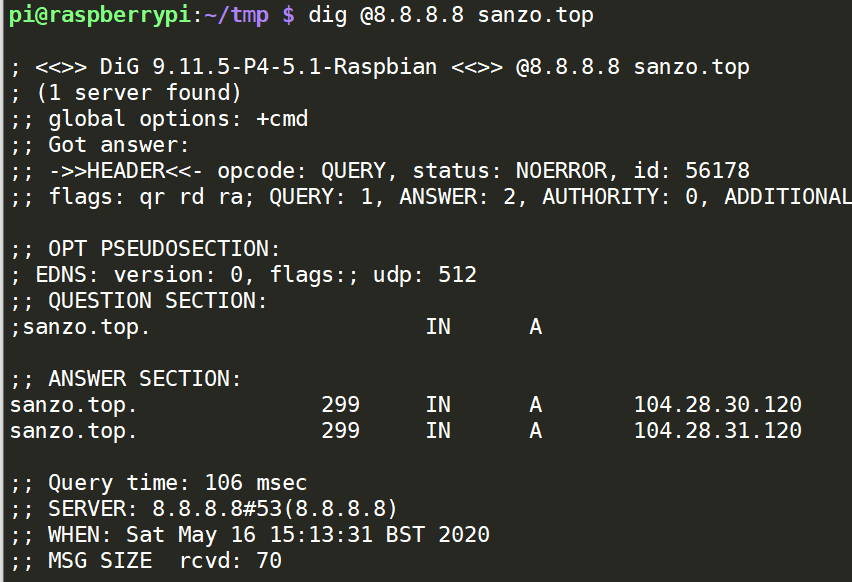
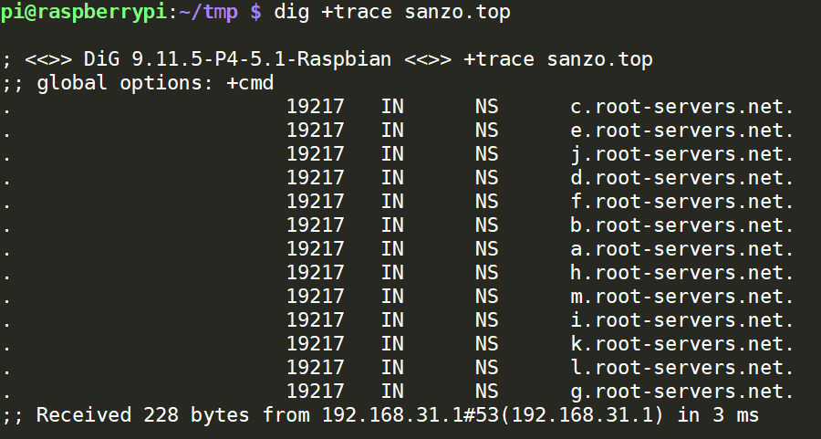

## DNS服务器

linux下产看DNS服务器的ip：

```bash
dig | grep SERVER

cat /etc/resolv.conf
```


一般家用的是一个内网地址，有一些公网的DNS服务器例如：谷歌的`8.8.8.8`

dig命令默认使用本地的DNS服务器，可以使用@来指定DNS服务器。

```bash
dig @8.8.8.8 sanzo.top
```




## 域名层级

每个域名后面都有一个**根域名**，例如`www.example.com`的真正域名为`www.example.com.root`，一般省略保留最后的`.`。

根域名的下一级是**顶级域名**，例如`。com`，在下一级是**次级域名**，例如`.example`，这一级域名是用户可以注册的，再下一级是**三级域名**，这是用户在自己的域名里面为服务器分配的名称，用户可以任意分配。

层级域名的结构一般为:

```bash
主机名.次级域名.顶级域名.根域名
hello.baidu.com.root
```


## 根域名服务器

DNS服务器根据域名的层级，来进行分级查询。每一级域名都有自己的NS记录，NS记录指向该域名的域名服务器，这些服务器知道下一级域名的各种记录。

分级查询就是从根域名开始，依次查找每一级的域名的NS记录，直到找到最终的IP地址。

- 从**根域名服务器**查到**顶级域名服务器**的NS记录和A记录（IP地址）
- 从**顶级域名服务器**查到**次级域名服务器**的NS记录和A记录（IP地址）
- 从**次级域名服务器**查到**主机名**的IP地址

根域名服务器的NS记录和IP地址，一般不会发生变化，它的TTL也很长有3600000s，相当于1000小时，也就是每隔1000小时查询一次根域名服务器。世界上一共有13组根域名服务器，从`A.ROOT-SERVERS.NET`到`M.ROOT-SERVERS.NET`。


## 分级查询实例

可以使用命令显式DNS的整个分级查询的过程：

```bash
dig +trace sanzo.top
```

首先显式根域名`.`的所有NS记录，根据内置的根域名服务器的IP地址，DNS服务器向所有的这些IP地址发送请求查询，询问顶级域名服务器`.com`NS记录。最先回复的根域名服务器将被缓存，以后只向这个服务器发出请求。



接着查到`.top`的8条NS记录，同时返回每条记录的IP地址，然后DNS服务器向这些顶级域名服务器发出查询请求，询问次级域名`sanzo.top`的NS记录。


查到2条A记录，即这个2个IP地址都可以访问到网站，并且显示了最先返回的NS服务器是`molly.ns.cloudflare.com`，它的IP是`173.245.58.205`


## DNS的记录类型

域名和IP之间对应的关系，称为记录。

常见的DNS记录类型：

- A：地址记录（Address），返回域名指向的IP。
- NS：域名服务器记录（Name Server），返回保存下一级域名信息的服务器地址。记录只能设置为域名，不能设置为IP地址。
- MX：邮件记录（Mail exchange），返回接受电子邮件的服务器地址。
- CNAME：规范名称（Canonical Name），返回一个域名，即当前查到的域名是另一个域名的跳转。
- PTR：你想查询记录（Pointer Record），只用于从IP地址查询域名。

一般为了服务的安全可靠，至少应该有两条`NS`记录。

`CNAME`记录主要用于域名的内部跳转，为服务器配置提供灵活性，用户感知不到，例如`sanzona.github.io`就是一个`CNAME`记录。

