---

typora-copy-images-to: img\matplotlib

---

[b站视频](https://www.bilibili.com/video/BV1Jx411L7LU)

[Matplotlib.ipynb](https://github.com/Sanzona/files/blob/master/ipynb/Matplotlib%E7%AC%94%E8%AE%B0.ipynb)

## 基本使用


```python
import matplotlib.pyplot as plt
import numpy as np

x = np.linspace(-1, 1, 50)
y = x ** 2

plt.plot(x, y)
plt.show()
```


## figure


```python
x = np.linspace(-1, 1, 50)
y1 = x ** 2
y2 = x ** 3

# figure1
plt.figure()
plt.plot(x, y1)
# figure2
plt.figure(num=10, figsize=(8,4))
plt.plot(x, y2)

plt.show()
```


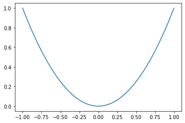


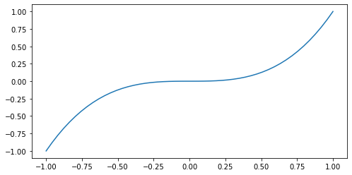


```python
x = np.linspace(-1, 1, 50)
y1 = x ** 2
y2 = x ** 3

# 画在一个图上
plt.figure()
plt.plot(x, y1)
plt.plot(x, y2, color='red', linewidth=2.0, linestyle='--')

plt.show()
```


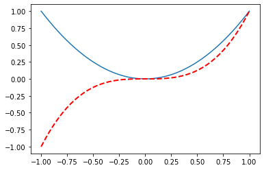


## 坐标轴


```python
x = np.linspace(-1, 10, 50)
y1 = x ** 2
y2 = x + 1

plt.figure()
plt.plot(x, y1)
plt.plot(x, y2, color='red', linewidth=2.0, linestyle='--')

# 设置X、Y范围
plt.xlim((-1, 2))
plt.ylim((-2, 3))

# lable说明
plt.xlabel('I am X')
plt.ylabel('I am Y')

# 单位
new_ticks = np.linspace(-1, 2, 5)
print(new_ticks)
plt.xticks(new_ticks)
plt.yticks([-2, -1.5, -1, 1.22, 3], ['really bad', 'bad', 'normal', 'good', 'really good'])
# 正则表达
plt.yticks([-2, -1.5, -1, 1.22, 3], [r'$really\ bad$', r'$\alpha$', 'normal', 'good', 'really good'])


# 获取当前的axis
ax = plt.gca()

# 隐藏右边和上面的轴
ax.spines['right'].set_color('none')
ax.spines['top'].set_color('none')

# 设置X、Y轴
ax.xaxis.set_ticks_position('bottom')
ax.yaxis.set_ticks_position('left')

# 设置X、Y轴位置
ax.spines['bottom'].set_position(('data', 0)) # outward，axes
ax.spines['left'].set_position(('data', 0))


plt.show()
```

    [-1.   -0.25  0.5   1.25  2.  ]


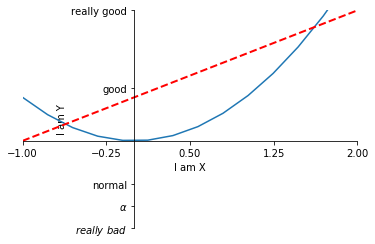


## 图例


```python
x = np.linspace(-1, 10, 50)
y1 = x ** 2
y2 = x + 1

plt.figure()
plt.xlim((-1, 2))
plt.ylim((-2, 3))
plt.xlabel('I am X')
plt.ylabel('I am Y')
new_ticks = np.linspace(-1, 2, 5)
print(new_ticks)
plt.xticks(new_ticks)
plt.yticks([-2, -1.5, -1, 1.22, 3], [r'$really\ bad$', r'$\alpha$', 'normal', 'good', 'really good'])

# 设置label
l1, = plt.plot(x, y1, label='blue')
l2, = plt.plot(x, y2, color='red', linewidth=2.0, linestyle='--', label='red')
# 添加图例
# plt.legend()
plt.legend(handles=[l1,l2], labels=['aa', 'bb'], loc='best')

plt.show()
```

    [-1.   -0.25  0.5   1.25  2.  ]


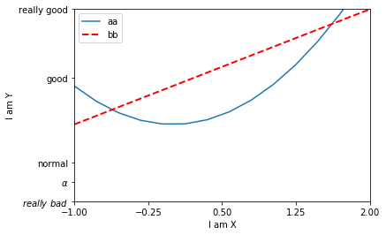


## 标注


```python
x = np.linspace(-10, 10, 50)
y = 2*x + 1

plt.figure()
plt.xlim((-3, 3))
plt.ylim((-6, 8))
plt.plot(x, y)

ax = plt.gca()
ax.spines['right'].set_color('none')
ax.spines['top'].set_color('none')
ax.xaxis.set_ticks_position('bottom')
ax.yaxis.set_ticks_position('left')
ax.spines['bottom'].set_position(('data', 0)) # outward，axes
ax.spines['left'].set_position(('data', 0))

x0 = 1
y0 = 2*x0 + 1
# 画点
plt.scatter(x0, y0, s=50, color='b')

# 画线
plt.plot([x0,x0], [y0,0], 'k--', lw=2.5)

# 箭头
plt.annotate(r'$2x+1=%s$' % y0, xy=(x0, y0), xycoords='data', xytext=(+30, -30),
             textcoords='offset points', fontsize=16,
             arrowprops=dict(arrowstyle='<->', connectionstyle="arc3,rad=.2"))

# 注释
plt.text(-4.5, 6, r'$This\ is\ the\ some\ text. \mu\ \sigma_i\ \alpha_t$',
         fontdict={'size': 16, 'color': 'r'})
plt.show()
```


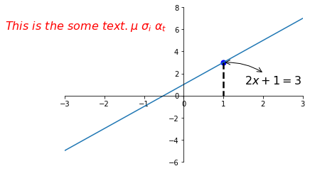


## 可见度


```python
import matplotlib.pyplot as plt
import numpy as np

x = np.linspace(-3, 3, 50)
y = 0.1*x

plt.figure()
plt.plot(x, y, linewidth=10, zorder=1)
plt.ylim(-2, 2)
ax = plt.gca()
ax.spines['right'].set_color('none')
ax.spines['top'].set_color('none')
ax.spines['top'].set_color('none')
ax.xaxis.set_ticks_position('bottom')
ax.spines['bottom'].set_position(('data', 0))
ax.yaxis.set_ticks_position('left')
ax.spines['left'].set_position(('data', 0))

# 设置XY轴的刻度
for label in ax.get_xticklabels() + ax.get_yticklabels():
    # 大小
    label.set_fontsize(12)
    # 背景
    label.set_bbox(dict(facecolor='white', edgecolor='none', alpha=0.5, zorder=2))

plt.show()
```


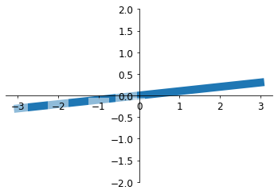


## 散点图


```python
 import matplotlib.pyplot as plt
import numpy as np

n = 1024    # data size

X = np.random.normal(0, 1, n)
Y = np.random.normal(0, 1, n)
T = np.arctan2(Y, X)    # for color later on

plt.scatter(X, Y, s=75, c=T, alpha=.5)

plt.xlim(-1.5, 1.5)
plt.ylim(-1.5, 1.5)

plt.xticks(())  # ignore xticks
plt.yticks(())  # ignore yticks

plt.show()
```


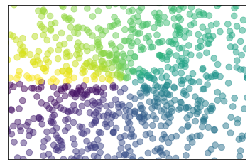


## 柱状图


```python
import matplotlib.pyplot as plt
import numpy as np

n = 12
X = np.arange(n)
Y1 = (1 - X / float(n)) * np.random.uniform(0.5, 1.0, n)
Y2 = (1 - X / float(n)) * np.random.uniform(0.5, 1.0, n)

plt.xlim(-.5, n)
plt.xticks(())
plt.ylim(-1.25, 1.25)
plt.yticks(())

# 设置颜色
plt.bar(X, +Y1, facecolor='#9999ff', edgecolor='white')
plt.bar(X, -Y2, facecolor='#ff9999', edgecolor='white')

for x, y in zip(X, Y1):
    # ha: horizontal alignment
    # va: vertical alignment
    plt.text(x, y + 0.05, '%.2f' % y, ha='center', va='bottom')

for x, y in zip(X, Y2):
    # ha: horizontal alignment
    # va: vertical alignment
    plt.text(x, -y - 0.05, '%.2f' % -y, ha='center', va='top')

plt.show()
```


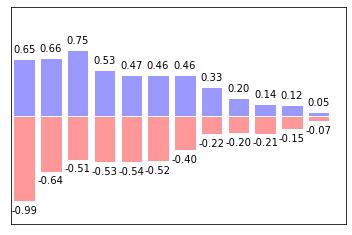


## 等高线


```python
import matplotlib.pyplot as plt
import numpy as np

def f(x,y):
    # the height function
    return (1 - x / 2 + x**5 + y**3) * np.exp(-x**2 -y**2)

n = 256
x = np.linspace(-3, 3, n)
y = np.linspace(-3, 3, n)
# 定义网格
X,Y = np.meshgrid(x, y)

# 根据高度分区，分成8份
plt.contourf(X, Y, f(X, Y), 8, alpha=.75, cmap=plt.cm.hot)

# 画等高线
C = plt.contour(X, Y, f(X, Y), 8, colors='black', linewidths=.5)

# lable
plt.clabel(C, inline=True, fontsize=10)

plt.xticks(())
plt.yticks(())
plt.show()
```


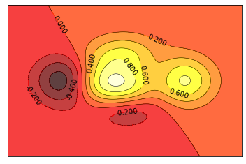


## 图像


```python
import matplotlib.pyplot as plt
import numpy as np

# image data
a = np.array([0.313660827978, 0.365348418405, 0.423733120134,
              0.365348418405, 0.439599930621, 0.525083754405,
              0.423733120134, 0.525083754405, 0.651536351379]).reshape(3,3)

"""
for the value of "interpolation", check this:
http://matplotlib.org/examples/images_contours_and_fields/interpolation_methods.html
for the value of "origin"= ['upper', 'lower'], check this:
http://matplotlib.org/examples/pylab_examples/image_origin.html
"""
plt.imshow(a, interpolation='nearest', cmap='bone', origin='lower')
plt.colorbar(shrink=.92)

plt.xticks(())
plt.yticks(())
plt.show()
```


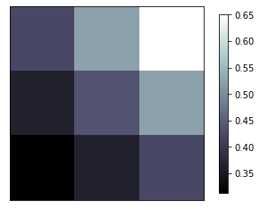


## 3D数据


```python
import numpy as np
import matplotlib.pyplot as plt
from mpl_toolkits.mplot3d import Axes3D

fig = plt.figure()
ax = Axes3D(fig)
# X, Y value
X = np.arange(-4, 4, 0.25)
Y = np.arange(-4, 4, 0.25)
X, Y = np.meshgrid(X, Y)

# height value
R = np.sqrt(X ** 2 + Y ** 2)
Z = np.sin(R)

# 3D图像
ax.plot_surface(X, Y, Z, rstride=1, cstride=1, cmap=plt.get_cmap('rainbow')) 

# 等高线
# zdir表示投影的平面，offset位置
ax.contourf(X, Y, Z, zdir='z', offset=-2, cmap=plt.get_cmap('rainbow'))
ax.set_zlim(-2, 2)

# 手动设置角度
# ax.view_init(elev=10, azim=80)

plt.show()
```

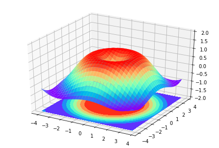


调和平均数（倒数平均数）：$2\frac{XY}{X+Y}$

```python
# 调和平均数
import matplotlib.pyplot as plt
from mpl_toolkits.mplot3d import Axes3D
import numpy as np

fig = plt.figure()
ax = Axes3D(fig)

x = np.linspace(0, 1, 20)
y = np.linspace(0, 1, 20)
x, y = np.meshgrid(x, y)
z = 2 * (x*y)/(x+y)

ax.set_xlabel('X')
ax.set_ylabel('Y')
ax.set_zlabel('Z')
ax.plot_surface(x, y, z, rstride=1, cstride=1, cmap=plt.get_cmap('rainbow'))

plt.show()
```

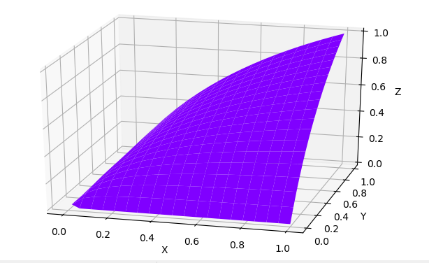


3维散点图

```python
import numpy as np
import matplotlib.pyplot as plt
from mpl_toolkits.mplot3d import Axes3D
 
data = np.random.randint(0, 10, 24).reshape((8, 3))
x = data[:, 0]
y = data[:, 1]
z = data[:, 2] 
 
fig = plt.figure()
ax = Axes3D(fig)
ax.scatter(x, y, z)
 
ax.set_zlabel('Z')
ax.set_ylabel('Y')
ax.set_xlabel('X')
plt.show()
```

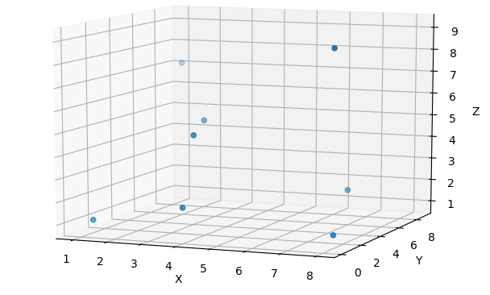


## subplot


```python
import matplotlib.pyplot as plt

plt.figure(figsize=(6, 4))

# plt.subplot(n_rows, n_cols, plot_num)
plt.subplot(2, 2, 1)
plt.plot([0, 1], [0, 1])

plt.subplot(222)
plt.plot([0, 1], [0, 2])

plt.subplot(223)
plt.plot([0, 1], [0, 3])

plt.subplot(224)
plt.plot([0, 1], [0, 4])

# 自动调整子图位置
plt.tight_layout()
plt.show()
```


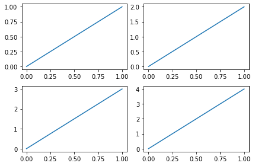


```python
plt.figure(figsize=(6, 4))

# plt.subplot(n_rows, n_cols, plot_num)
plt.subplot(2, 1, 1)
# figure splits into 2 rows, 1 col, plot to the 1st sub-fig
plt.plot([0, 1], [0, 1])

plt.subplot(234)
# figure splits into 2 rows, 3 col, plot to the 4th sub-fig
plt.plot([0, 1], [0, 2])

plt.subplot(235)
# figure splits into 2 rows, 3 col, plot to the 5th sub-fig
plt.plot([0, 1], [0, 3])

plt.subplot(236)
# figure splits into 2 rows, 3 col, plot to the 6th sub-fig
plt.plot([0, 1], [0, 4])

# 自动调整子图位置
plt.tight_layout()
plt.show()
```


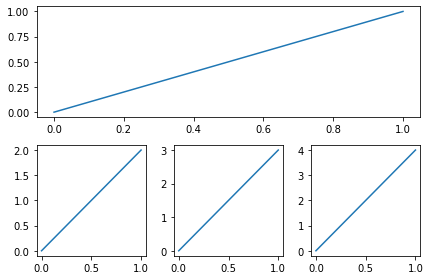


```python
# method 1: subplot2grid
import matplotlib.pyplot as plt

plt.figure()
ax1 = plt.subplot2grid((3, 3), (0, 0), colspan=3)  # stands for axes
ax2 = plt.subplot2grid((3, 3), (1, 0), colspan=2)
ax3 = plt.subplot2grid((3, 3), (1, 2), rowspan=2)
ax4 = plt.subplot2grid((3, 3), (2, 0))
ax5 = plt.subplot2grid((3, 3), (2, 1))

ax1.set_title('ax1_title')
ax1.plot([1, 2], [1, 2])

ax4.scatter([1, 2], [2, 2])
ax4.set_xlabel('ax4_x')
ax4.set_ylabel('ax4_y')

plt.tight_layout()
plt.show()
```


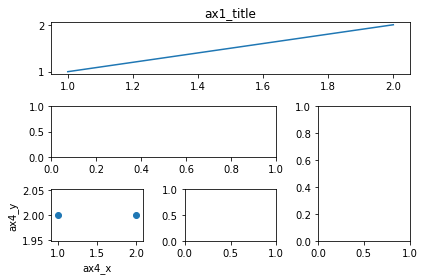


```python
# GridSpec
import matplotlib.gridspec as gridspec

plt.figure()
gs = gridspec.GridSpec(3, 3)
# use index from 0
ax6 = plt.subplot(gs[0, :])
ax7 = plt.subplot(gs[1, :2])
ax8 = plt.subplot(gs[1:, 2])
ax9 = plt.subplot(gs[-1, 0])
ax10 = plt.subplot(gs[-1, -2])

plt.tight_layout()
plt.show()
```


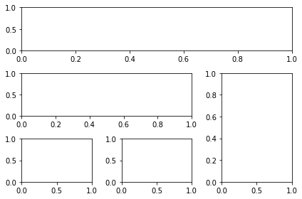


```python
f, ((ax11, ax12), (ax13, ax14)) = plt.subplots(2, 2, sharex=True, sharey=True)
ax11.scatter([1,2], [1,2])

plt.tight_layout()
plt.show()
```


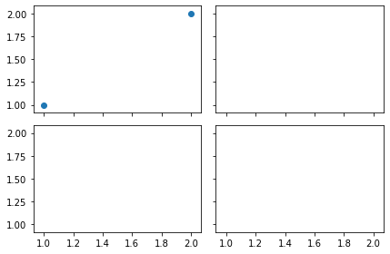


## 画中画


```python
import matplotlib.pyplot as plt

fig = plt.figure()
x = [1, 2, 3, 4, 5, 6, 7]
y = [1, 3, 4, 2, 5, 8, 6]

# below are all percentage
left, bottom, width, height = 0.1, 0.1, 0.8, 0.8
ax1 = fig.add_axes([left, bottom, width, height])  # main axes
ax1.plot(x, y, 'r')
ax1.set_xlabel('x')
ax1.set_ylabel('y')
ax1.set_title('title')

ax2 = fig.add_axes([0.2, 0.6, 0.25, 0.25])  # inside axes
ax2.plot(y, x, 'b')
ax2.set_xlabel('x')
ax2.set_ylabel('y')
ax2.set_title('title inside 1')


# different method to add axes
plt.axes([0.6, 0.2, 0.25, 0.25])
plt.plot(y[::-1], x, 'g')
plt.xlabel('x')
plt.ylabel('y')
plt.title('title inside 2')

plt.show()
```


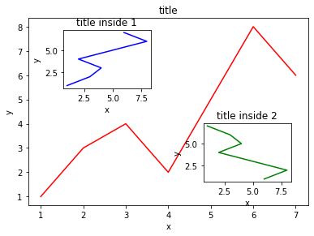


## 次坐标轴


```python
import matplotlib.pyplot as plt
import numpy as np

x = np.arange(0, 10, 0.1)
y1 = 0.05 * x**2
y2 = -1 *y1

fig, ax1 = plt.subplots()

ax2 = ax1.twinx()    # mirror the ax1
ax1.plot(x, y1, 'g-')
ax2.plot(x, y2, 'b-')

ax1.set_xlabel('X data')
ax1.set_ylabel('Y1 data', color='g')
ax2.set_ylabel('Y2 data', color='b')

plt.show()
```


## 动画


```python
import numpy as np
from matplotlib import pyplot as plt
from matplotlib import animation

fig, ax = plt.subplots()

x = np.arange(0, 2*np.pi, 0.01)
line, = ax.plot(x, np.sin(x))


def animate(i):
    line.set_ydata(np.sin(x + i/10.0))  # update the data
    return line,


# Init only required for blitting to give a clean slate.
def init():
    line.set_ydata(np.sin(x))
    return line,

# call the animator.  blit=True means only re-draw the parts that have changed.
# blit=True dose not work on Mac, set blit=False
# interval= update frequency
ani = animation.FuncAnimation(fig=fig, func=animate, frames=100, init_func=init,
                              interval=20, blit=False)

# save the animation as an mp4.  This requires ffmpeg or mencoder to be
# installed.  The extra_args ensure that the x264 codec is used, so that
# the video can be embedded in html5.  You may need to adjust this for
# your system: for more information, see
# http://matplotlib.sourceforge.net/api/animation_api.html
# anim.save('basic_animation.mp4', fps=30, extra_args=['-vcodec', 'libx264'])

plt.show()
```

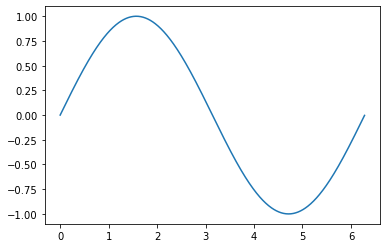


## 01-Matplotlib初识

```python
import matplotlib.pyplot as plt

# 1, 创建figure对象
fig = plt.figure(figsize=(20, 8), dpi=60)

# 2, 利用fig对象创建子图， 一个fig对象可以包含多个子图
# 2.1， 使用fig.add_subplot()函数创建子图axes对象， 这个函数接收三个参数，
#  add_subplot(num_rows, num_cols, plot_num)
#  如果num_rows + num_cols + plot_num < 10, 那么下列的写法可以省略
# axes_1 = fig.add_subplot(1, 2, 1)
# axes_2 = fig.add_subplot(1, 2, 2)
# fig对象包含两个子图axes1， axes2， 构成1*2排列方式
# axes_1 = fig.add_subplot(121)
# axes_2 = fig.add_subplot(122)

# 构成2*1
# axes_1 = fig.add_subplot(211)
# axes_2 = fig.add_subplot(212)

# 有三个子图， 上边两个，  下一个
# axes_1 = fig.add_subplot(221)
# axes_2 = fig.add_subplot(222)
# axes_3 = fig.add_subplot(212)

# 有4个子图 ， 左边2个上下排列，  右边排一个，  最下方排一个
axes_1 = fig.add_subplot(321)
axes_2 = fig.add_subplot(323)
axes_3 = fig.add_subplot(222)
axes_4 = fig.add_subplot(313)

# 3, 利用子图对象绘制一个折线图
axes_1.plot([1,2,1,2,-1])
axes_2.plot([0.5, 0.2, -0.4, -0.5])
axes_3.plot([1,2,1,2,-1])
axes_4.plot([0.5, 0.2, -0.4, -0.5])


plt.show()
```

## 02-Axes子图

```python
import matplotlib.pyplot as plt


# 1  设置figure
plt.figure(figsize=(20,10), dpi = 60)
# 1,1   设置显示中文
plt.rcParams['font.sans-serif'] = ['SimHei']

# 绘制子图
plt.subplot(211)
plt.title("时间和速度的关系图")
# 将x轴当做时间， 
plt.xlabel("时间")
# 设置y轴的label
plt.ylabel("速度")

# 第二个子图
plt.subplot(212)
# 设置标题
plt.title("时间和加速度的关系")
# x轴
plt.xlabel("时间")
# y轴
plt.ylabel("加速度")

# 绘制
plt.show()
```

## 03-绘制图并设置坐标轴

```python
import matplotlib.pyplot as plt
import numpy as np


# 1, 创建一个ndarray  0-0.99
data = np.arange(0, 1, 0.01)

# 2, 设置figure
plt.figure(figsize=(20,10))
# 3, 设置标题
plt.title("line ex")
# 4, 设置坐标轴
plt.xlabel('x')
plt.ylabel('y')

# 5,限制坐标轴刻度
plt.xlim(0,1)
plt.ylim(0,1)

# 6, 设置刻度数据
plt.xticks([0,0.3,0.6,0.9,1])
plt.yticks([0,0.2,0.4,0.6,0.8,1])

# 7 绘制
plt.plot(data, data ** 2, label = 'y = x^2')
# 追加绘制
plt.plot(data, data ** 3, label = 'y = x^3')

# 加上网格
plt.grid()

# 加上图示   方式一直直接通过legend函数来渲染图示
# plt.legend(['y = x^2', 'y = x^3'])

# 如果图形过多 ， 可以在绘制图形时指定label， 然后再渲染
plt.legend()

# 显示
plt.show()
```

## 04-心率练习图

```python
import matplotlib as mp
import matplotlib.pyplot as plt
import numpy as np
import random

#  显示用户可选参数
# print(mp.rc_params())
# 拖过plt.rcParams设置是全局设置，会影响当前fig对象中的所有axes对象中的所有绘制的图
# 通过中午可显示
plt.rcParams['font.sans-serif'] = ['SimHei']
# 设置字体大小
plt.rcParams['font.size'] = 11

plt.figure(figsize=(20, 8),dpi=60)

# x  轴
x_show = [f'10点{i}分' for i in range(60)]
# y  轴
y_data = [random.randint(60,101) for i in range(60)]
x_old = range(1,61)

# 设置刻度
plt.xticks(list(x_old)[::2], x_show[::2], rotation=45)
plt.yticks(range(60,101))

plt.title("心率变化图")
plt.xlabel('时间')
plt.ylabel('心率')

# 绘制
plt.plot(x_old, y_data, marker='o')

plt.grid()

plt.show()

```


```

```

## 05-绘制三角函数

```python
import numpy as np
import matplotlib.pyplot as plt


# 准备数据
data = np.arange(0, np.pi * 2, 0.01)
# print(data)
plt.rcParams['font.sans-serif'] = ['SimHei']
plt.rcParams['axes.unicode_minus'] = False
# 创建figure对象
fig = plt.figure(figsize=(10, 9), dpi=60)
# 添加子图axes1
axes_sin = fig.add_subplot(211)
axes_cos = fig.add_subplot(212)
# 标题
plt.title("三角函数曲线图示")
# x 轴
plt.xlabel('X')
plt.ylabel('Y')
# 限制y轴值
plt.ylim(-1, 1)
# 限制x轴值
plt.xlim(0, np.pi * 2)
# 调整刻度
plt.xticks([0, np.pi/2, np.pi, np.pi*3/2, np.pi*2])
plt.yticks([-1, -0.5, 0, 0.5, 1])
#绘制
axes_sin.plot(data, np.sin(data), label='sin')
axes_cos.plot(data, np.cos(data), label='cos')
# 渲染
plt.legend()
plt.show()


# axes1_tan = fig.add_subplot(223)
# axes1_cot = fig.add_subplot(224)


```

## 06-全局设置和axes设置

```python
import matplotlib as mp
import matplotlib.pyplot as plt
import numpy as np
import random

#  显示用户可选参数
# print(mp.rc_params())
# 拖过plt.rcParams设置是全局设置，会影响当前fig对象中的所有axes对象中的所有绘制的图
# 通过中文可显示
plt.rcParams['font.sans-serif'] = ['SimHei']
# 设置字体大小
plt.rcParams['font.size'] = 11


plt.figure(figsize=(20, 8),dpi=60)

# x  轴
x_show = [f'10点{i}分' for i in range(60)]
# y  轴
y_data = [random.randint(60,101) for i in range(60)]
y_data2 = [random.randint(40,120) for i in range(60)]
x_old = range(1,61)

# 设置刻度
plt.xticks(list(x_old)[::2], x_show[::2], rotation=45)
plt.yticks(range(60,101))

plt.title("心率变化图")
plt.xlabel('时间')
plt.ylabel('心率')

# 绘制
# 可以对需要的绘制样式进行设置   alpha 透明度  
plt.plot(x_old, y_data, marker='o', markersize=4, linestyle='-', color='g', alpha=1)
plt.plot(x_old, y_data2, marker='8', markersize=5, linestyle='-', color='m')


plt.grid()
plt.show()

```

## 07-填充函数

```python
import numpy as np
import matplotlib.pyplot as plt

# 生成数据
x = np.linspace(0, 1, 500)
y = np.sin(3 * np.pi * x)

# 绘制
fig, ax = plt.subplots()
plt.plot(x, y)


# 第一种填充方式
# plt.fill_between(x, 0, y, facecolor='g', alpha=0.3)
# plt.fill_between(x[15:200], 0, 0.5, facecolor='r', alpha=0.9)

# 第二种填充方式
plt.fill(x, y)

# 显示
plt.show()
```

## 08-绘制散点图

```python
import numpy as np
import matplotlib.pyplot as plt

plt.rcParams['font.sans-serif'] = ['SimHei']
plt.rcParams['axes.unicode_minus'] = False

plt.xlabel('X')
plt.ylabel('Y')
plt.title('散点图')

ax = plt.subplot(111)

# # 数据
# x = np.arange(1, 30)
# y = np.sin(x)

# # 子图
# ax1 = plt.subplot(111)

# # 绘制散点图
# # linewidths 缺省参数是根据x的值来设置大小
# ax1.scatter(x, y, color='r', linewidths=x)

# # 显示
# plt.show()

# ----------------------绘制多个散点图
for color in ['red', 'blue', 'green']:
    # 定义散点数量
    count = 500
    # 随机生成符合正态分布的点
    x, y = np.random.randn(2, count)
    # 绘制
    ax.scatter(x, y, color=color, alpha=0.3, label=color)
    ax.grid()
    ax.legend()

plt.show()
```

## 09-绘制饼图

```python
import matplotlib.pyplot as plt

# 设置fig
plt.figure(figsize=(6,6))

# 显示坐标系
plt.tick_params(labelsize=10)
# 设置饼的位置
plt.axes([0.1, 0.1, 0.8, 0.8])

# 饼图每一份标签
labels = ['python', 'c', 'js', 'go']
# 饼图的每一份所占的比例
x = [40, 15, 15, 30]
# 饼图的每份偏移量
explode = [0, 0, 0, 0.1]

# 绘制饼图
plt.pie(x, labels=labels, autopct='%1.1f%%', explode=explode)
# 显示
plt.show()
```

## 10-绘制柱状图（直方图）

```python
import matplotlib.pyplot as plt
import pandas as pd
import numpy as np

plt.rcParams['font.sans-serif'] = ['SimHei']
plt.rcParams['axes.unicode_minus'] = False

# 创建fig
# plt.figure()
# plt.subplots()
# plt.subplot()

fig, ax = plt.subplots(2, 1)

# 准备数据
data = pd.Series(np.random.randn(8), index=list('abcdefgh'))
# 直接使用pandas中的series对象来绘制图
data.plot.bar(ax = ax[0], color='r', alpha=0.7)
data.plot.bar(ax = ax[1], color='g', alpha=0.7)

# 显示
plt.show()
```

