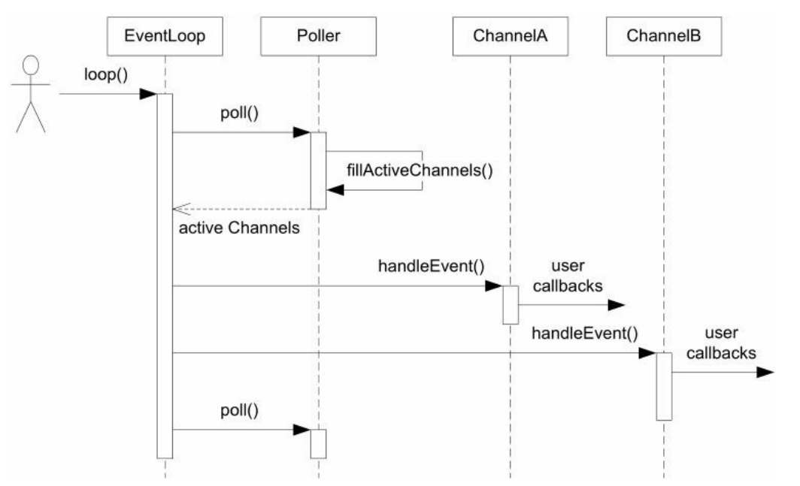
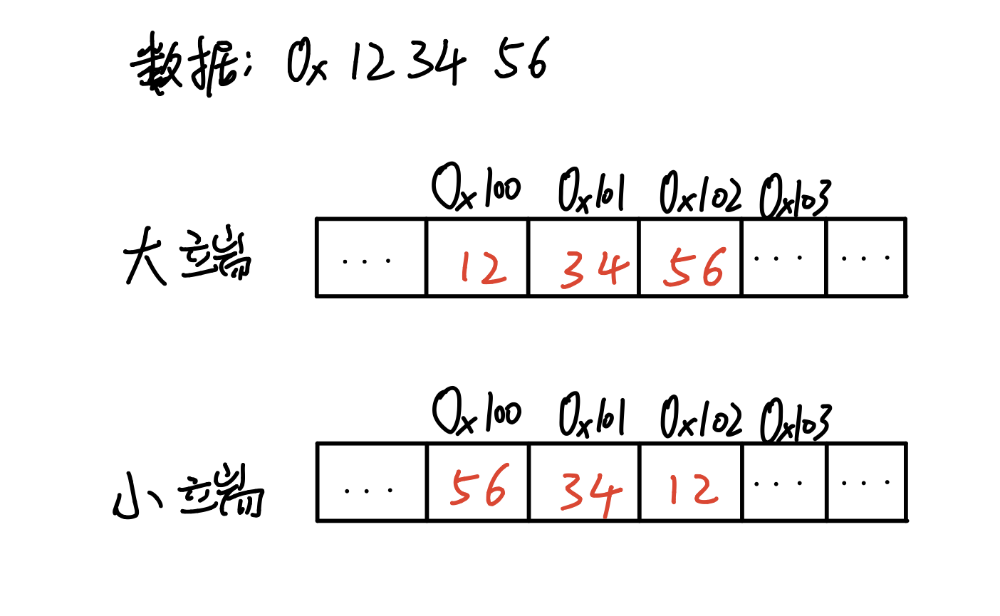
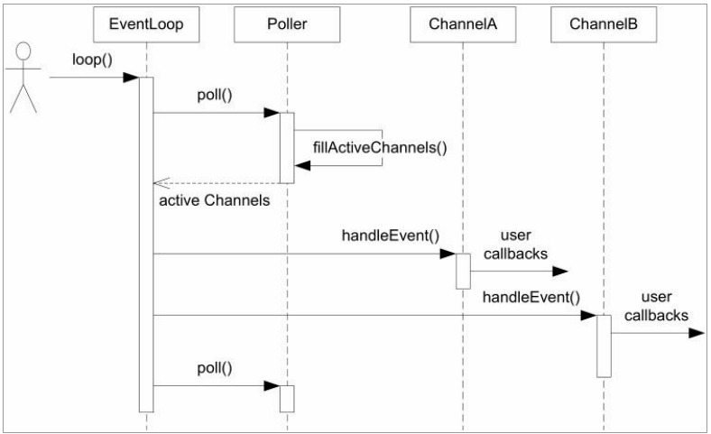
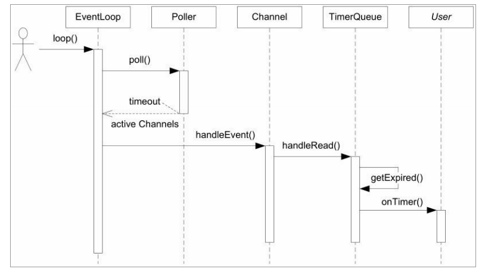
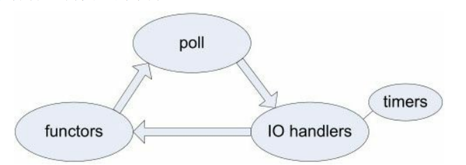
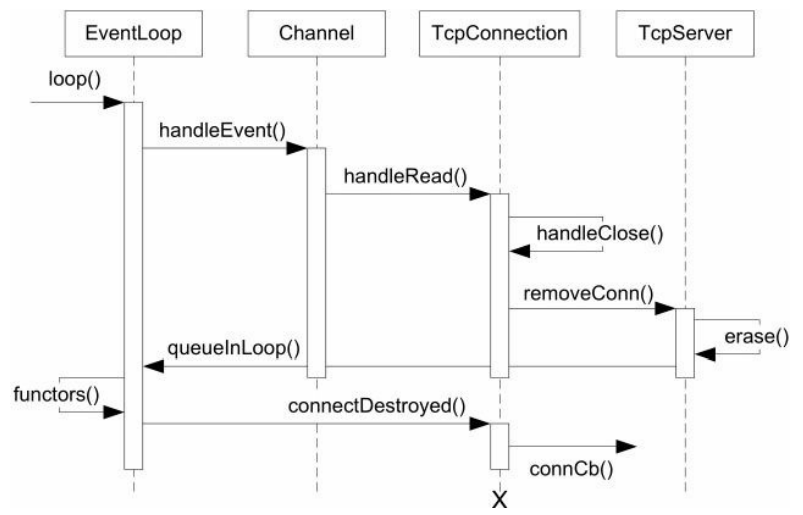
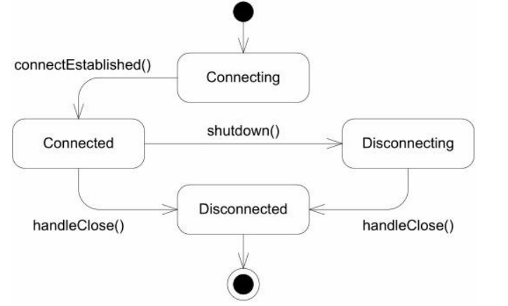
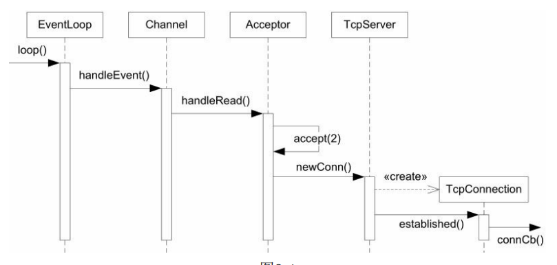

# muduo学习笔记

## 第一章 C++多线程系统编程

### 1.1 智能指针

C++中动态内存管理是用new和delete完成。

动态内存管理经常出现两种问题:

- 忘记释放内存造成内存泄露
- 还有指针引用的内存的情况下释放内存，造成引用非法内存指针

智能指针负责自动释放所指向的对象


### 1.2 构造函数

- 如何判断构造函数的执行结果？
  - 构造没有返回值不能通过返回值判断
  - 状态量，抛出异常？
  - 条件判断，例如构造函数的功能，如果涉及内存申请，判断地址是否合法
  - 二段式构造
- 构造函数中执行return， return之后的语句不再执行，生成一个半成品的对象
- 构造函数执行结束不意味着对象构造成功，内存申请不一定成功

构造函数只提供初始化变量，不保证初始化一定成功


### 1.3 二段式构造

对象的构造不能在构造期间泄露this指针，否则会返回一个半成品的对象

二段式构造将构造分为两个阶段，第一个阶段为资源无关的初始化，第二阶段是与系统资源相关的初始化（申请内存，访问文件）


```c
#include <iostream>
using namespace std;

class Test {
public:
	char* p;
	int val;
	Test() { // 第一阶段构造
		val = 10;
	}
	bool construct() { // 第二阶段构造
		p = new char('a');
		if (p == nullptr)
			return false;
		else
			return true;
	}

	static Test* instance() {
		Test* ret = new Test(); // 执行第一阶段构造
		if (ret == nullptr || ret->construct() == false) { // 执行第二阶段构造
			delete ret;
			ret = nullptr;
		}
		return ret;
	}

	~Test() {
		delete p;
		p = nullptr;
	}
};

void run() {
	Test* t = Test::instance();
	if (t == nullptr) {
		cout << "False\n";
	}
	else {
		cout << t->val << " " << *(t->p) << endl;
	}
}
```

使用二段式构造就不能使用默认的构造函数直接生成对象，否则会忽略第二阶段的construct函数。通过使用instance函数保证构造函数的完整运行。


### 1.4 析构函数的线程安全

析构函数在多线程中使用mutex不一定能保证线程的安全性

成员函数用来保护临界区的互斥器mutex是必要的，但是析构函数破坏了这一假设，它直接包mutex成员变量销毁了。

```c
Foo::~Foo() {
    MutexLockGuard lock(mutex_);
    // free internal state (1)
}

void Foo::update() {
    MutexLockGuard lock(mutex_); (2)
    // make use of internal state
}

extern Foo* x; // 对每个线程可见

// thread A
delete x;
x = NULL;

// thread B
if (x) {
    x->update();
}
```

虽然线程A销毁对象之后将其设置NULL, 线程B在执行的时候判断指针是否为NULL, 但是当A持有互斥锁处在(1), B阻塞处在(2)。当析构函数把mutex销毁之后，线程B可能永久阻塞、进入临界区、coredump...


### 1.5 多个对象的mutex

低地址加锁

```c
void swap(Counter& a, Counter& b) {
    MutexLockGuard aLock(a.mutex_); // potential dead lock
    MultexLokGuard bLock(b.mutex_);
    int64_t value = a.value_;
    a.value_ = b.value_;
    b.value_ = value;
}
```

如果有两个线程, A执行swap(a, b), 执行swap(b, a), 就可能发生死锁.

如果一个函数要锁住多个相同类型的多个对象, 为了保证始终按照相同顺序加锁, 可以比较mutex对象的地址, 始终先对地址小的加锁


### 1.6 智能指针

#### shared_ptr

通过引用计数可以不必担心多个指针指向同一个对象,何时销毁对象的问题，但同同时也存在引用成环的问题。

shared_ptr不是100%线程安全的，引用计数本身是安全且无锁的，对象的读写不是，shared_ptr有两个数据成员，读写操作不能原子化

```c
class A {
public:
	int i;
	A(int n) : i(n) {}
	~A() {
		cout << i << " is destructed" << endl;
	}
};

void run() {
	shared_ptr<A> p1(new A(1)); // A(1)由p1托管
	shared_ptr<A> p2(p1);		// A(1)同时由p2托管
	shared_ptr<A> p3;
	p3 = p2;	// A(1)同时由p3托管
	cout << p1->i << " " << p2->i << " " << p3->i << endl; // 输出 1 1 1

	A* p = p1.get();	// get返回托管的指针, p指向A(1)
	cout << p->i << endl; // 输出1

	p1.reset(new A(2));	// 托管新的指针
	p2.reset(new A(3));
	p3.reset(new A(4));
	// 无人托管A(1), A(1)自动析构

	cout << "over" << endl;
	// 函数结束后,A(2),A(3),A(4)也析构
}
```

#### weak_ptr

配合shared_ptr解决引用成环的问题

先来看看引用成环的例子

```c
class B;
class A {
public:
	A() {
		cout << "A的构造函数\n";
	}
	~A() {
		cout << "A的析构函数\n";
	}
	void set_ptr(shared_ptr<B>& ptr) {
		m_ptr_b = ptr;
	}
    void show() {
		cout << "this is class A" << endl;
	}
private:
	shared_ptr<B> m_ptr_b;
};

class B {
public:
	B() {
		cout << "B的构造函数\n";
	}
	~B() {
		cout << "B的析构函数\n";
	}
	void set_ptr(shared_ptr<A>& ptr) {
		m_ptr_a = ptr;
	}
    void show() {
		cout << "this is class B" << endl;
	}
private:
	shared_ptr<A> m_ptr_a;
};

void run() {
	shared_ptr<A> ptr_a(new A());
	shared_ptr<B> ptr_b(new B());
	cout << "ptr_a use count: " << ptr_a.use_count() << endl;
	cout << "ptr_b use count: " << ptr_b.use_count() << endl;
	ptr_a->set_ptr(ptr_b);
	ptr_b->set_ptr(ptr_a);
	cout << "ptr_a use count: " << ptr_a.use_count() << endl;
	cout << "ptr_b use count: " << ptr_b.use_count() << endl;
}
/*
    A的构造函数
    B的构造函数
    ptr_a use count: 1
    ptr_b use count: 1
    ptr_a use count: 2
    ptr_b use count: 2
*/
```

当run函数运行结束之后，ptr_a和ptr_b被销毁，但是A和B的析构函数没有执行。这是因为A和B内部的ptr的引用不为0导致指向的内部对象无法析构，造成内存泄漏。

解决的方法是将A和B中的一个成员变量改为weak_ptr，weakptr不会增加引用计数，引用不会成环，析构就可以顺利进行

```c++
public:
	B() {
		cout << "B的构造函数\n";
	}
	~B() {
		cout << "B的析构函数\n";
	}
	void set_ptr(shared_ptr<A>& ptr) {
		m_ptr_a = ptr;
	}
private:
	weak_ptr<A> m_ptr_a;
};

/*
    A的构造函数
    B的构造函数
    ptr_a use count: 1
    ptr_b use count: 1
    ptr_a use count: 1
    ptr_b use count: 2
    A的析构函数
    B的析构函数
*/
```

shared_ptr是强引用，控制对象的生命期

weak_ptr是弱引用，不控制对象的生命期

```c++
void run() {
	shared_ptr<A> ptr_a(new A());
	weak_ptr<A> wk_ptr_a = ptr_a;
	cout << "ptr_a use count: " << ptr_a.use_count() << endl; // 输出1

	if (!wk_ptr_a.expired()) {
		wk_ptr_a.lock()->show();
	}

	wk_ptr_a.reset();
	if (wk_ptr_a.expired()) {
		cout << "wk_ptr_a is invalid" << endl;
	}
}
```

- weak_ptr不会增加引用计数，不拥有对象，通过lock方法临时拥有对象

- 通过expired判断对象的生死


### 1.7 C++的内存问题

1. 缓冲区溢出 (buffer overrun)
2. 空悬针/野指针
3. 重复释放 (double delete)
4. 内存泄漏 (memory leak)
5. 不配对的new[]/delete
6. 内存碎片 (memory fragmentation)

内存泄漏的危害性较小，他只是借东西不还，程序功能在一段时间内还算正常。缓冲区溢出和重复释放等会造成安全性的严重后果


## 第二章 线程同步精要

### 2.1 互斥器 (mutex)

互斥器保护了临界区，任何时刻最多只能有一个线程在mutex划出的临界区内活动

推荐使用原则：

- 用RAII手法封装mutex的创建、销毁、加锁、解锁四个操作
- 只是用非递归的mutex (不可重入的mutex)
- 不手动调用lock()和unlock()函数，交给栈上的Guard对象的构造和析构负责
- 使用Guard对象时考虑调用栈上持有的锁，防止加锁顺序不同导致死锁

#### 非递归的mutex

mutex分为递归和非递归，也称为可重入和非可重入。区别在于：同一个线程可以重复对recursive mutex加锁，不能重复对non-recursive mutex加锁。

在同一线程中对non-recursive mutex重复加锁会立刻导致死锁，可以帮助在编码阶段发现问题。

recursive mutex可能会隐藏一些问题，当你以为拿到一个锁就能修改对象，没想到外层代码已经拿到了锁，正在修改或读取同一个对象

```c++
MutexLock mutex;
std::vector<Foo> foos;

void post(const Foo& f) { // 加锁修改对象
    MutexLockGuard lock(mutex);
    foos.push_back(f);
}

void traverse() { // 加锁访问对象
    MutexLockGuard lock(mutex);
    for (std::vector<Foo>::const_iterator it = foos.begin();
        it != foos.end(); ++it) {
        it->doit();
    }
}
```

如果Foo::doit()间接调用post，Mutex为非递归就会发生死锁，Mutex为递归可能会导致vector的迭代器失效，程序偶尔crash

解决上面问题有两种做法：

- 把修改推迟，记录循环中试图添加修改的元素，等到循环结束再调用post
- 如果一个函数可能在加锁的情况被调用，可以把函数拆成两部分
  - 跟原函数同名，函数加锁，调用第二个函数
  - 函数名加后缀WithLockHold，不加锁，把原来的函数体搬过来

```c
void post(const Foo& f) {
    MutexLockGuard lock(mutex);
    postWithLockHold(f);	// 编译器自动内联
}
void postWithLockHold(const Foo& f) {
    foos.push_back(f);
}
```

如上也会造成两个问题：

1. 误用加锁版本，死锁
2. 误用不加锁版本，数据损坏

对于(1)可以通过调用栈进行排错，对于(2)可以在调用的时候判断锁是否时调用线程加的 (isLockedByThisThread)


### 2.2 条件变量

- 条件变量和mutex一起使用, 布尔表达式受mutex保护

- 将布尔条件判断和wait放到while循环中

    ```c
    muduo::MutexLock mutex;
    muduo::Condition cond(mutex);
    std::deque<int> queue;

    int dequeue() { // 出队
        MutexLockGuard lock(mutex);
        while (queue.empty()) { // 用循环先判断在wait
            cond.wait();	// 原子操作,unlock mutex进入等待,不与enqueue竞争锁
            // wait()执行完重新加锁
        }    
    }

    void enqueue(int x) {
        MutexLockGuard lock(mutex);
        queue.push_back(x);
        cond.notify();
    }
    ```

    上面代码必须用while循环等待条件变量, 不能用if语句, 可能存在spurious wakeup

- broadcast通常用于表明状态变化, signal通常用于表示资源可用

- 条件变量是底层的同步原语,通常用来实现高层的同步措施

  - BlockingQueue<T>

  - DountDownLatch (倒计时)

    - 主线程发起多个子线程,等待子线程各自完成一定任务后, 主线程继续执行, 通常用于主线程等待多个子线程完成初始化
    - 主线程发起多个子线程, 子线程等待主线程, 主线程完成一定任务后通知所有的子线程开始执行，通常用于多个子线程等待主线程发出“起跑”命令

    ```c
    class CountDownLatch : boost::noncopyable{  
    public:
        explicit CountDownLatch(int count); // 倒数几次
        void wait();		// 等待计数器变为0
        void countDown();	// 计数器减1
    private:
        muteable MutexLock mutex_;
        Condition condition_;
        int count_;
    };

    void CountDownLatch:: wait() {
        MutexLockGuard lock(mutex_);
        while (count_ > 0)
            condition_.wait();
    }

    void Count DownLatch:: countDown() {
        MutexLockGuard lock(mutex_);
        --count_;
        if (count == 0)
            condition_.notifyAll();
    }
    ```


### 2.3 不要用读写锁和信号量

#### 对写锁

- 典型错误，在持有read lock时候修改共享数据。不小心在read lock保护的函数中调用了会修改状态的函数。

- read lock加锁的开销不比mutex lock小，每次要更新reader的个数

- reader lock的可重入可能造成死锁

  1. 线程1加读锁，进行读操作

  2. 线程2加写锁， 等待线程1，阻塞后面的读操作
  3. 线程1内部间接调用读操作，因为reader lock的可重入，线程1的读操作阻塞
  4. 发生死锁


#### 信号量

作者不建议用互斥量

对于哲学家就餐问题，在教科书的解决方案是平权，每个哲学家有自己的线程，自己去拿筷子。作者认为集权的方式，用一个线程专门负责餐具的分配，让其他哲学家拿着号等在食堂门口（condition variable），这样不损失多少效率同时简化程序


### 2.4 小结

- 线程同步尽量用高层同步设施（线程池、队列、倒计时）
- 让一个正确的程序变快，远比“让一个快的程序变正确”容易的多
- 真正影响性能的不是锁，而是锁争用（lock contention）
- sleep不是同步原语，尽量少使用，可以采用唤醒、轮询、timer的方式
- 使用shared_ptr，读操作增加引用计数，写的时候用shared_ptr::unique()判断是否有其他用户在读。如果没有用户读直接修改，如果有可以拷贝一份，在副本上修改。使用shared_ptr::swap()更新指针


## 第三章 多线程服务器的适合场合与常用编程模型

### 3.1 基本概念

- 同步和异步

  针对程序和内核的交互

  - 同步：用户进程触发IO操作，等待或轮询的查看IO是否就绪

  - 异步：用户进程触发IO操作，继续做自己的事情，当IO操作完成通知进程

- 阻塞和非阻塞

  针对进程在访问数据，更具IO的状态采取不同的方式

  - 阻塞：数据的读写会一直等待
  - 非阻塞：数据的读写会立即返回状态值

- IO模型

  - 同步阻塞IO：用户进程发起IO操作，阻塞等待IO的完成，之后继续运行剩下的程序，浪费CPU资源
  - 同步非阻塞IO：用户进程发起IO操作，可以返回做其他的事情，需要用户进程不断询问IO操作是否就绪，浪费比必要的CPU资源
  - 异步阻塞IO：用户进程发起IO操作，不等待，当内核完成通知用户进程，但通过select函数判断文件描述符的状态是阻塞的
  - 异步非阻塞IO：用户进程发起IO操作，不等待，当内核完成通知用户进程，对数据进行处理

### 3.2 单线程服务器的常用编程模型

- non-blocking IO + IO multiplexing: 事件循环(event loop)，事件驱动(event-driven)和事件回调的方式实现

- Reactor模型
  - 优点：编程容易，效率高
  - 缺点：基于事件驱动的模型要求事件回调函数必须是非阻塞的，涉及到网络IO请求响应式协议，容易割裂业务逻辑，使其分布在多个回调函数中，不容易理解和维护

### 3.3 多线程服务器的常用编程模型

1. 每个请求创建一个线程，使用阻塞式IO
2. 使用线程池，同样使用阻塞式IO
3. non-blocking IO + IO multiplexing
4. Leader/Follower


### 3.4 进程间通信只用TCP

- 进程间通信(IPC):

  - 匿名管道（pipe）

  - 具名管道（FIFO）

  - POSIX消息队列

  - 共享内存

  - 信号

  - Socket

- 同步原语：

  - 互斥锁（mutex）
  - 条件变量（condition variable）

  - 读写锁（reader-writer lock）

  - 文件锁（record locking）

  - 信号量（semaphore）

- TCP port有进程独占，操作系统会自动回收， listening port和已建立连接的TCPsocket都是文件描述符，当进程结束会关闭所有的文件描述符。程序意外退出不会留下垃圾，程序重启后比较容易恢复，不需要重启系统。port的独占可以防止程序重复运行
- TCP长连接的好处：
  - 容易定位分布式系统中的服务之间的依赖关系
  - 通过接受和发送队列的长度比较容易定位网络或程序故障，正常情况netstat打印的Recv-Q和Send-Q都应该接近0，或在0附近摆动。Recv-Q保持不变或持续增加，通常意味着服务进程的处理速度变慢，可能发生阻塞或死锁。如果Send-Q保持不变或持续增长，有可能对方服务器太忙、来不及处理，也有可能网络中某个路由器或交换机故障造成丢包，甚至对方掉线


## 第四章 C++多线程系统编程精要

- pthreads只保证同一进程之内，同一时刻的各个线程的id不同，不能保证同一进程先后多个进程具有不同的id，更不要说一台机器上多个进程之间的id唯一性，pthread_t不适合用做程序对线程的标识符。

- 推荐使用  **gettid()** 的返回值作为线程id

  - 返回值类型pid_t，通常是小整数，便于在日志输出
  - 可以在/proc文件系统中找到对应项，/proc/tid，/proc/pid/task/tid
  - 任何时候全局唯一
  - top判断CPU占有最高的线程id
  - pid = 0非法，系统的第一个进程init的pid = 1


### 4.1 线程的创建和销毁应该遵循的原则

  - 程序库不应该在未提前告知的情况下创建自己的“背景线程”
  - 尽量用相同的方式创建线程
  - 在进入main()函数之前不应该启动线程
  - 程序中线程的创建最好能在初始化阶段全部完成

### 4.2 线程的销毁方式

  - 自然死亡，从线程主函数返回，线程正常退出
  - 非正常死亡，从县城主函数抛出异常或线程触发segfault信号等非法操作
  - 自杀，在线程中调用pthread_exit()来立刻退出线程
  - 他杀，其他线程调用pthread_cancel()来强制终止某个线程

  线程正常退出的方式只有一种，自然死亡。强制终止线程的话，没有机会清除所有的资源，也没有机会释放已经持有的锁，其他线程如果对同一个mutex加锁，那么他就会立刻死锁。

  如果程序中线程的创建能在初始化阶段全部完成，线程是不必销毁的，伴随程序的一直运行，彻底避开了线程安全退出可能面临的各种困难


### 4.3 exit在C++中不是线程安全的

exit()函数在C++中的作用除了终止进程，还会析构全局对象和已经构造完的函数静态对象。存在潜在的死锁可能

```c
void someFunctionMayCallExit() {
    exit(1);
}
class GlobalObject {
public:
	void doit() {
        MutexLockGuard lock(mutex_);
        someFunctionMayCallExit();
    }
	~GlobalObject() {
        printf("GlobalObject: ~GlobalObject\n");
        MutexLockGuard lock(mutex_); // 死锁
        //clean up
        printf("GlobalObject:~GlobalObject cleanning\n");
    }    
private:
    MutexLock mutex_;
};

GlobalObject g_obj;
int main() {
    g_obj.doit();
}
```


### 4.4 多线程与IO

- 多线程与IO可能存在的问题：

  - 线程正在阻塞read某个socket，另一个线程close这个socket

  - 线程正在阻塞的accept某个listening socket，另一个线程close()这个socket

  - 线程准备read某个socket，另一个线程close socket，第三个线程又open了相同的fd的socket。POSIX标准要求每次新打开的文件使用当前最小的可用的文件描述符

- 为什么服务端程序不应该关闭标准输出和标准出错？

  有些第三方库会向stdout和stderr打印出错信息，如果程序关闭了标准输入和标准出错，可能被网络连接占用，造成对方收到莫名其妙的数据。正确的做法是把stdout和stderr重定向到磁盘文件


### 4.5 多线程与fork


  fork之后，子进程继承了父进程的几乎全部状态，有些少数例外。子进程会继承地址空间和文件描述符。

  子进程不会继承的有：

  - 父进程的内存锁，mlock，mlockall
  - 父进程的文件锁，fcntl
  - 父进程的某些定时器，setitimer，alarm，timer_create
  - 其他

fork()之后子进程只有一个线程，其他线程都消失了。这可能存在隐患：一些线程持有锁处于临界区，而子线程试图对同一个mutex加锁，这会造成死锁。

fork()之后，子进程不能调用：

- malloc，malloc在访问全局状态时，几乎肯定会加锁
- 任何可能分配或释放内存的函数，new，map::insert()，snprintf
- 任何pthread函数
- printf函数，其他线程可能恰好持有stdout/stderr锁
- 除了signal安全函数之外的任何函数

唯一安全的做法是在fork()之后立即调用exec()执行另一个程序，彻底隔断子进程与父进程的联系


## 第五章 高效的多线程日志

- 日志有两种意思：

  - 诊断日志

  - 交易日志

- 本章讲的是前一种日志，文本的供人阅读的日志，通常用于故障诊断和追踪，也可用于性能分析。

- 日志通常要记录：

  - 收到的每条消息的id（关键字段，长度，hash等）

  - 收到的每条外部消息的全文

  - 发出每条消息的全文，每条消息都有全局唯一的id

  - 关键部分状态的变更，等等

### 5.1 功能需求

- 日志库大体分为前端和后端两个部分

  - 前端负责提供应用程序使用的接口API，并生成日志消息
  - 后端负责把日志消息写到目的地

- C++日志库的前端大体有两种API风格

  - printf的格式化输出风格
  - stream<<风格

  stream风格的好处是当输出日志级高于语句的日志级别时，打印日志操作时个空操作，运行时开销接近零

- 分布式系统中的服务进程而言，日志的目的地只有一个：本地文件。往网络写日志消息时不靠谱的，因为诊断日志功能之一正是诊断网络故障，如果日志消息也是通过网络发到另一台机器就一损俱损...

- 本地文件作为destination，日志文件的滚动是必须的，可以简化日志的归档实现

  - 文件大小（例如写满10GB就换下一个文件）
  - 时间（例如每天零点新建一个日志文件，不论上一个文件是否写满）

  日志文件压缩和归档，不应该是日志库应有的功能，应该交给专门的脚本去做

- 日志重复利用空间的功能，只会帮倒忙

- 往文件写日志的常见问题是，如果程序崩溃，最后几条日志信息就会丢失，因为日志库不能每条消息都flush硬盘，更不能每条消息都open/close文件，这样开销太大。

  - 定时（默认3秒）将缓冲区的日志消息flush到硬盘
  - 每条内存中的日志消息都带有cookie，其值为函数地址，通过core dump文件找到cookie就能找到尚未写到硬盘的消息

### 5.2 性能需求

- 日志库的高性能体现在：
  - 每秒写几千上万条日志的时候没有明显的性能损失
  - 能应对一个进程产生大量日志数据的场景，1GB/min
  - 不阻塞正常的执行流程
  - 在多线程中不造成争用
- muduo日志库的实现的优化措施：
  - 时间戳字符串中的日期和时间两部分是缓冲的，一秒之内的多条日志只需重新格式化微妙部分
  - 日志消息前4个字节是定长的，避免在运行期间求strlen，编译器认识memcpy()函数，对于定长的内存复制，会在编译期把它inline展开为高效的目标代码
  - 线程id时预先格式化为字符串，输出只需要拷贝几个字节
  - 每条日志消息的源文件名部分采用了编译期计算来获得basename，避免运行期strrchr()开销

### 5.3 多线程异步日志

多线程程序的每个进程最好写一个日志文件，这样分析日志最容易，不必再多个文件中跳来跳去

- muduo日志库采用的时双缓冲技术

  准备两块buffer：A和B，前端负责往buffer A写入数据，后端负责将buffer A的数据写到文件中，之后前端往buffer B中填入新的数据，如此反复。

  用两个buffer的好处是在新建日志消息的时候不必等待磁盘文件操作，也避免每条新日志消息都触发后端日志线程，换句话就是前端不是将每一条日志消息分别送给后端，而是将多条日志消息平成一个大的buffer传给后端，相当于批处理，减少线程唤醒的开销，降低开销。

  为了及时将日志消息写道文件，即使buffer A没有满，日志库也要没3秒执行一次swap(buffer A, buffer B)

- muduo采用前端后端，各两个buffer（curr buffer，next buffer）和一个buffer vector保存full buffer四种可能存在的情况

  - 前端写日志频率不高，后端3秒超时写入文件

    

    在第2.9s，curr使用了80%，第3秒后端线程醒过来，将curr送到buffers，把new1移动到curr，随后交换buffers和buffersToWrite，当文件写完之后，把new1重新填上，等待下次cond.waitForSeconds()返回

  - 3秒超时之前已经写满burr buffer，唤醒后端开始写入文件

    

    在第1.5s，curr使用了80%，在1.8scurr写满送到buffers，将next替换到curr buff，唤醒后端线程。后端将curr加到buffers中，在把new1移动到curr，交换buffers和buffersToWrite，new2替换next。完成之后重新填充new1和new2


  - 前端短时间密集写入日志消息，用完了两个缓冲需要新分配缓冲

    

    在第1.8s，A已经写满，B接近满，已经notify()后端线程，但是后端线程由于一些原因没有立即响应，到1.9s线程B写满，前端线程新创建缓冲E。在1.8s+后端线程获得控制权，将C，D移动给前端，把当前的curr放到buffers，将A、B、E写到文件。使用A、B填充new1/2释放缓冲E


  - 文件写入速度较慢，导致前端耗尽了两个缓冲，并分配了新缓冲

    

    1.8s前和场景2相同，后端线程写入过慢，导致前端已经写满两个缓冲并且分配了一个新的缓冲，这期间notify已经丢失。当后端完成之后，发现buffers不为空，立刻进入下个循环


## 第八章 muduo网络库设计与实现

### 8.1 Reactor的关键结构

#### 8.1.1 Channel Class

每个Channel对象只属于一个event loop，每个Channel对象只负责一个fd的IO事件分发，不拥有fd，析构不会关闭fd

Channel记录了所属的EventLoop，fd，poller用到的events和revents，还有在Poller的pollfds_数组中的下标index用于update， 用户定义的回调函数

```c
EventLoop* 	loop_;
const 		int fd_;
int 		events_;
int 		ervents_;
int 		index_;	// used by Poller

EventCallback readCallback_;
EventCallback writeCallback_;
EventCallback errorCallback_;
```

Channel::handleEvent()是Channel的核心，由EventLoop::loop()调用，根据revents_的值调用不同的用户回调

```c
void Channel::handleEvent()
{
	if (revents_ & POLLNVAL) {
		LOG_WARN << "Channel::handle_event() POLLEVAL";
	}
	if (revents_ & (POLLERR | POLLNVAL)) {
		if (errorCallback_) errorCallback_();
	}
	if (revents_ & (POLLIN | POLLPRI | POLLRDHUP)) {
		if (readCallback_) readCallback_();
	}
	if (revents_ & POLLOUT) {
		if (writeCallback_) writeCallback_();
	}
}
```

Channel::update()会调用EventLoop::updateChannel()，后者调用Poller::updateChannel()


#### 8.1.2 Poller class

Poller是EventLoop的间接成员，Poller供EventLoop调用的函数有两个：poll()和updateChannel()

Poller记录了所属的EventLoop，fd到Channel*的映射ChannelMap，缓存的pollfds_数组

 ```c
typedef std::vector<struct pollfd> PollFdList;
typedef std::map<int, Channel*> ChannelMap;
EventLoop* ownerLoop_;
PollFdList pollfds_;
ChannelMap channels_;
 ```

Poller::poll()是Poller的核心功能，调用poll获取当前活动的IO事件，然后调用Poller::fillActiveChannels填充调用方传入的activeChannels，返回poll return的时刻

```c
void Poller::fillActiveChannels(int numEvents,
									ChannelList* activeChannels) cosnt
{
    // 遍历pollfds数组
	for (PollFdlist::const_iterator pfd = pollfds_.begin();
		 pfd != pollfds_end() && numEvents > 0; ++pfd)
	{
		if (pfd->revents > 0) { // 判断是否为活动事件
			--numEvents;
			ChannelMap::const_iterator ch = channels_.find(pfd->fd);	// 找到map中对应迭代器位置
			assert(ch != channels_.end());
			Channel* channel = ch->second;	// 找到对应的Channel*
			assert(channel->fd() == pfd->fd);
			channel->set_revents(pfd->revents);	// 设置活动事件
			activeChannels->push_back(channel);	// 加到activeChannels
		}
	}
}
```

Poller::updateChannel()的主要功能是负责维护和更新pollfds数组，添加新的Channel的复杂读是O(logN)，更新Channel的复杂度是O(1), 因为Channel记住了自己在pollfds_数组的下标

````c
void Poller::updateChannel(Channel* channel)
{
	assertInLoopThread();
	LOG_TRACE << "fd = " << channel->fd() << " events = " << channel->events();
	if (channel->index() < 0) {	// 添加新的Channels
		assert(channels_.find(channel->fd()) == channels_.end());
		struct pollfd pfd;
		pfd.fd = channel->fd();
		pfd.events = static_cast<short>(channel->events());
		pfd.revents = 0;
		pollfds_.push_back(pfd);
		int idx = static_cast<int>(pollfds_size()) - 1;
		channel->set_index(idx);
		channels_[pfd.fd] = channel;	// map插入复杂读O(logN)
	}else {
		assert(channels_.find(channel->fd()) != channels_.end());
		assert(channels_[channel->fd()] == channel);
		int idx = channel->index();
		assert(0 <= idx && idx < static_cast<int>(pollfds_.size()));
		struct pollfd& pfd = pollfds_[idx];
		pfd.events = static_cast<short>(channel->events());
		pfd.revents = 0;
		if (channel->isNoneEvent()) {
			pfd.fd = -1; // 不关心这个pollfd
		}
	}
}
````


#### 8.1.3 EventLoop的改动

EventLoop增加了quit()，通过scoped_ptr间接持有Poller。

EventLoop::loop()调用Poller::poll()获得当前活动事件的Channel列表，依次调用每个Channel的handleEvent()函数。




### 8.2 TimerQueue定时器

muduo的定时器由三个类实现，TimerId、Timer、TimerQueue

#### Timer

Timer中包含了定时器的回调函数、超时时间、定时器的重启等

```c
const TimerCallback callback_;
Timestamp expiration_;
const double interval_;
const bool repeat_;
```

```c
void Timer::restart(Timestamp now)
{
	if (repeat_) {
		expiration_ = addTime(now, interval_);
	}else {
		expiration_ = Timestamp::invalid();
	}
}
```


#### TimerQueue

TimerQueue的接口只有两个函数addTimer()和cancel()。

TimerQueue的数据结构采用的是set<pair<TimeStamp, Timer*>>

- addTimer()

  addTimer()是提供给EventLoop使用的，EventLoop封装了runAt()，runAfter()、runEvery()等函数

```c
TimerId TimerQueue::addTimer(const TimerCallback& cb,
							 Timestamp when,
							 double interval)
{
	Timer* timer = new Timer(cb, when, interval);
	loop_->assertInLoopThread();
    // 判断新加的Timer的超时时间是否小于TimerList中的最小的时间
    // 如果是，重新设置当前的超时任务
	bool earliestChanged = insert(timer);

	if (earliestChanged) {
        // 重置当前的超时任务
		resetTimerfd(timerfd_, timer->expiration());
	}
	return TimerId(timer);
}
```

EventLoop创建Poller和TimerQueue，Poller获取事件的发生，TimerQueue管理定时任务TimerList，TimerQueue在初始化的时候将TimerQueue::handleRead绑定到timerfdChannels。当Poller有新的事件，EventLoop调用Channel的回调函数


### 8.3 EventLoop::runInLoop

测试代码

```c
#include "EventLoop.h"
#include "EventLoopThread.h"
#include <stdio.h>

void runInThread()
{
	printf("runInThread(): pid = %d, tid = %d\n",
			getpid(), muduo::CurrentThread::tid());
}

int main()
{
	printf("main(): pid = %d, tid = %d\n",
			getpid(), muduo::CurrentThread::tid());
	muduo::EventLoopThread loopThread;
	muduo::EventLoop* loop = loopThread.startLoop();

	loop->runInLoop(runInThread);
	sleep(1);
	loop->runAfter(2, runInThread);
	sleep(3);
	loop->quit();
	printf("exit main.\n");
}
```


EventLoopThread的构造函数会创建一个线程，当调用EventLoopThread::startLoop创建一个loop返回，此时的loop的threadId_和主线程的tid不同。

loop调用EventLoop::runInLoop，因为调用方的tid和loop的threadId_不同，不会直接执行回调函数，转而调用EventLoop::queueInLoop(cb)，将回调函数加到队列中。

EventLoop的构造函数会创建一个wakeFd_，并将对应的Channel加入到poll中，当EventLoop::queueInLoop调用EventLoop::wakeup触发wakeFd写事件，此时唤醒poller，继而执行EventLoop::doPendingFunctors。

IO线程在遇到以下两种情况时被唤醒：

- 调用queueInLoop的不是IO线程
- IO线程调用queueInLoop，此时正在调用pendingfunctor

```c
void EventLoop::queueInLoop(const Functor& cb)
{
	{
		MutexLockGuard lock(mutex_);
		pendingFunctors_.push_back(cb);
	}
	if (!isInLoopThread() || callingPendingFunctors_) {
		wakeup();
	}
}
```

```c
while (!quit_) {
    activeChannels_.clear();
    pollReturnTime_ = poller_->poll(kPollTimeMs, &activeChannels_);
    for (ChannelList::iterator it = activeChannels_.begin();
         it != activeChannels_.end(); ++it)
    {
        (*it)->handleEvent();
    }
    doPendingFunctors();
}
```


### 8.4 实现线程库

- SocketsOps自定义sockets的命名空间封装了网络通信常用的函数：bind, listen, accept, close和字节序的转换。
- InetAddress是对sockaddr_in的封装，提供两种构造函数：给定端口、给定ip和端口，另外还有以字符串的形式获取当前的ip+port
- Socket管理套接字的文件描述符，提供地址的绑定，端口的监听，建立连接，设置端口复用功能

测试用例

```c
void newConnection(int sockfd, const muduo::InetAddress& peerAddr)
{
	printf("newConnection(): accepted a new connection from %s\n",
			peerAddr.toHostPort().c_str());
	::write(sockfd, "How are you?\n", 13);
	muduo::sockets::close(sockfd);
}

int main()
{
	printf("main(): pid = %d\n", getpid());
	muduo::InetAddress listenAddr(9981);
	muduo::EventLoop loop;
	muduo::Acceptor acceptor(&loop, listenAddr);
	acceptor.setNewConnectionCallback(newConnection);
	acceptor.listen();

	loop.loop();
	return 0;
}
```

- InetAddress设置服务器监听的ip和端口信息

- acceptor完成socket的创建和初始化，acceptor的handleread的逻辑是每次accept一个socket，调用绑定的newConnectionCallback_回调函数，处理请求
- setNewConnectionCallback设置accept连接之后的回调函数

## 其他

### 三个半事件

1. 连接建立：包括服务端被动（accept）和客户端主动发起连接（connect）。TCP连接一旦建立，客户端和服务端就是平等的，各自收发数据
2. 连接断开：包括主动断开（close，shutdown）和被动断开（read返回0）
3. 消息到达：文件描述符可读，这是最重要的一个事件，对它的处理方式决定了网络编程风格（阻塞和非阻塞，如何处理分包，应用层的缓冲如何设计等）
4. 消息发送完毕：这算半个事件，对于低流量的服务，可以不用关心这个事件。发送完毕是指数据写入操作系统缓冲区（内核缓冲区），由TCP协议负责数据的发送和重传，不代表对方已经收到数据


### POLL事件标志

| 常量 | 说明 |
| ---- | ---- |
|POLLIN	|普通或优先级带数据可读|
|POLLRDNORM|	普通数据可读|
|POLLRDBAND|	优先级带数据可读|
|POLLPRI|	高优先级数据可读|
|POLLOUT|	普通数据可写|
|POLLWRNORM|	普通数据可写|
|POLLWRBAND|	优先级带数据可写|
|POLLERR|	发生错误|
|POLLHUP|	发生挂起|
|POLLNVAL|	描述字不是一个打开的文件|


### timerfd接口

timerfd把事件变为一个文件描述符，该文件描述符在超时时变为刻度，这种特性可以把定时事件和其他I/O事件以一样方式处理

```c
// 头文件
#include <sys/timerfd.h>文件

// 创建timerfd，成功返回文件描述符，失败返回-1
timerfd_create(int clockid, int flags);
clockid:
	CLOCK_REALTIME: 距离1970.1.1的事件
    CLOCK_MONOTONIC: 系统重启到现在的事件
flags:
	TFD_CLOEXEC: 新的文件描述符设置运行时关闭标志
    TFD_NONBLOCK: 非阻塞方式
    0   

strct itimerspec {
	struct timespec it_interval; // 间隔时间
    struct timespec it_value;	 // 第一次到期时间
}    

struct timespec{
    time_t tv_sec;	// 秒
    long tv_nsec;	// 纳秒
}     
// 设置timerfd，成功返回0，失败返回-1
int timerfd_settime(int fd, int flags, const struct
		itimerspec* new_value, struct itimerspec* old_value);
flag:
	0: 相对时间
	TFD_TIMER_ABSTIME: 相对时间
new_value: 指定新的超时时间
    new_value.it_value非0启动定时器，否则关闭定时器
    new_value.it_value为0，定时器启动一次，否则每隔一段时间启动
old_value: 返回定时器之前的超时时间    
```


### insert的返回值

```c
set<int> st;
pair<set<int>, bool> ret = st.insert(1);
cout << *t.first << endl; 	// 输出1
cout << t.second << endl;	// 输出1

ret.first插入元素的迭代器
ret.second成功插入返回1， 否则返回0    
```


### std::copy

```c
copy(start, end, dest);

// 将vector<int> b拷贝到a的后面（追加）
copy(b.begin(), b.end(), back_inserter(a));
// 将vector<int> b拷贝到a的前面
copy(b.begin(), b.end(), a.begin());
```

### 字节序

数据存储有两种方式：大端字节序和小端字节序

网络序采用大端，本地存储采用小端

- 大端字节序：数据的高位在地址的低位，从左到右（符合人读数的习惯）

- 小端字节序：数据的高位在地址的高位，从右向左

  


```c
#include <endian.h>

(无符号)64字节主机转网络：htobe64(uint64_t data)

(无符号)64字节网络转主机：be64toh(uint64_t data)

(无符号)32字节主机转网络：htobe32(uint32_t data)

(无符号)32字节网络转主机：be32toh(uint32_t data)

(无符号)16字节主机转网络：htobe16(uint16_t data)

(无符号)16字节网络转主机：be16toh(uint16_t data)  
```


```c
#include <endian.h>
#include <iostream>
using namespace std;

int main()
{
	uint16_t a = 1;
	cout << "sizeof uint16_t = " << sizeof(uint16_t) << endl;	// 2

	char* p = (char*)&a;
	cout << "a = " << a << endl;	// 1
    // 电脑存储默认是小端，数据的高位在地址的高位
	cout << (int)*p << " " << (int)(*(p+1)) << endl;	// 1 0

	a = htobe16(a);
	cout << "a = " << a << endl;	// 256
	cout << (int)*p << " " << (int)(*(p+1)) << endl;	// 0 1

	return 0;
}
```

### iter_swap

swap不能交换两个迭代器，使用iter_swap可以交换两个迭代器的值，

```c
vector<int> v(2);
v[0] = 1;
v[1] = 2;
iter_swap(v.begin(), v.begin()+1);
```


## base库

### copyable、noncopyable

删除默认的拷贝构造和赋值来实现类的不可拷贝的属性。

```c
noncopyable(const noncopyable&) = delete;
void operator=(const noncopyable&) = delete;
```


### Atomic

Atomic是原子操作类，它是一个模板类，使用GCC提供的加减和逻辑原子操作来实现。

```c
private:
	volatile T value_;

// 原子比较和交换，先判断*ptr是否和oldval相等, 如果相等将值设置为newval
__sync_val_compare_add_swap(type *ptr, type oldval, newval);

// value_ += x;
__sync_fetch_and_add(&value_, x);

// value_ = newValue;
__sync_lock_test_and_set(&value_, newValue);
```

通过以上代码，封装自增、自减和赋值等原子操作。

Atomic的类模板定义在`namespace detail`中，在`namespace muduo`使用模板创建了两个类。

```c
typedef detail::AtomicIntegerT<int32_t> AtomicInt32;
typedef detail::AtomicIntegerT<int64_t> AtomicInt64;
```


### Timestamp

[代码链接](https://github.com/Sanzona/learn_muduo/blob/master/muduo/base/Timestamp.cpp)

Timestamp使用微妙来计算时间，提供`toString`和格式化的接口，可以获取当前时间，返回一个对应的Timestamp对象，也可以返回一个

```c
static Timestamp now(); // 返回当前时间
static Timestamp invalid(); // 返回一个空对象
string toString() const; // 返回（秒.微妙）格式
string toFormattedString(bool showMicroseconds = true) const; // 格式化时间，年月日 时:分:秒.微妙
```

Timestamp继承`boost::less_than_comparable`，只需提供`<`的实现，自动实现`>`、`<=`、`>=`，继承`boost::equality_comparable`只需提供`==`自动实现`!=`。

```c
class Timestamp :  
	public boost::equality_comparable<Timestamp>,
	public boost::less_than_comparable<Timestamp>        
```

 跨平台，`int64_t`在32位系统是`long long int(%lld)`, 在64位系统是`long int(%ld)`

```c
printf("%" PRId64 "\n", value);
```


### Date

[代码链接](https://github.com/Sanzona/learn_muduo/blob/master/muduo/base/Date.cpp)

使用`julianDayNumber`来计算年月日。距离公元前4713年1月1日的天数。和Timestamp类似，提供一些常用的接口。

```c
YearMonthDay getYearMonthDay(int julianDayNumber); // 获取对应的年月日
int getJulianDayNumber(int year, int month, int day)// 获取julian day
string Date::toIsoString(); // 格式化（年-月-日）
```

### Mutex

[代码链接](https://github.com/Sanzona/learn_muduo/blob/master/muduo/base/Mutex.h)

Mutex封装锁，提供加锁解锁等操作。

```c
// 属性
pthread_mutex_t mutex_; // 定义一把锁
pid_t holder_;			// 记录加锁的线程ID
```

Mutex中一共有3个类：`MutexLock`、`UnassignGuard`、`MutexLockGuard`。

`MutexLock`使用`pthread_mutex_`函数封装初始化锁、加锁、解锁、销毁锁的操作。

`UnassignGuard`是`MutexLock`的内部类，他的特点是在构造函数中清除锁的持有者ID，析构的时候设置锁的持有者ID，这是供``Condition`的`wait()`使用。

`MutexLockGuard`采用RAII，构造的时候申请资源`lock`，析构的时候释放资源`unlock`，解放双手。


### Condition

[代码链接](https://github.com/Sanzona/learn_muduo/blob/master/muduo/base/Condition.h)

`Condition`实现条件变量功能，使用`pthread_cond_`函数来封装`wait()`，`notify()`，`notifyAll`功能。也是采用RAII的机制，在构造中初始化条件变量`pcond_`，在析构函数中销毁条件变量。

`Condition`是`MutexLock`的友元，可以使用`MutexLock`的内部类`UnassignGuard`来实现`wait()`的功能。

`pthread_cond_wait`内部的机制时在线程进入阻塞前释放资源，当函数返回，重新持有锁。

```c
void wait()
{
    MutexLock::UnassignGuard ug(mutex_);
    int ret = pthread_cond_wait(&pcond_, mutex_.getPthreadMutex()); // 将线程添加到条件变量
    assert(ret == 0);
}
```


### CountDownLatch

[代码链接](https://github.com/Sanzona/learn_muduo/blob/master/muduo/base/CountDownLatch.cpp)

倒计时类，将MutexLock和Condition封装在一起。

```c
mutable	MutexLock mutex_;
Condition 	condition_;
int 		count_;

void wait(); // 调用Condition等待
void countDown(); // 技术减1
int getCount(); // 获取当前的计数
```


### Thread

[代码链接](https://github.com/Sanzona/learn_muduo/blob/master/muduo/base/Thread.cpp)

线程类，在namespace muduo中定义了ThreadNameInitializer类负责主线程的初始化操作，指定如果fork之后再之进程中执行after函数。

```c
ThreadNameInitializer()
{
    muduo::CurrentThread::t_threadName = "main";
    CurrentThread::tid();
    pthread_atfork(NULL, NULL, &afterFork);
}
```

设置ThreadData的结构体，保存线程的回调函数，名字，id，计数等信息。在ThreadData中定义了runInThread函数，用来执行回调函数。

线程执行的流程是：

- Thread构造，设置回调函数func_，默认CountDownLatch为1。

- pthread_create创建线程，绑定回调函数startThread，将ThreadData作为参数，创建成功之后主线程阻塞在latch_上，等待子线程的退出。
- 在startThread中调用ThreadData的runInThread函数
- latch_-1唤醒主线程，同时执行回调函数func\_，同时对异常进行处理。


### CurrentThread

[代码链接](https://github.com/Sanzona/learn_muduo/blob/master/muduo/base/CurrentThread.cpp)

主线程类，提供stackTrace()用于查看堆栈的信息，同时包括线程的一些基本属性，id、名字等。


### Exception

[代码链接](https://github.com/Sanzona/learn_muduo/blob/master/muduo/base/Exception.h)

异常处理类，继承std::exception，封装CurrentThread类的stackTrace()和重写what()方法。


### BlockingQueue

[代码链接](https://github.com/Sanzona/learn_muduo/blob/master/muduo/base/BlockingQueue.h)

无界阻塞队列，底层是deque，利用条件变量实现一个生产者消费者模型，另外还有一个有界的阻塞队列（[BoundedBlockingQueue](https://github.com/Sanzona/learn_muduo/blob/master/muduo/base/BoundedBlockingQueue.h)），底层是circular_buffer。


### StringPiece

[代码链接](https://github.com/Sanzona/learn_muduo/blob/master/muduo/base/StringPiece.h)

C++支持两种字符串：string和char*，当char\*传入函数，会构造一个临时的string变量，这就发生了内存的拷贝。StringPiece就是为了减少这种内存的拷贝，统一使用char\*记录字符串。重载了[]、等于、比较等操作。重载<<支持logged的使用。


### LogStream

[代码链接](https://github.com/Sanzona/learn_muduo/blob/master/muduo/base/LogStream.cpp)

muduo的日志库采用C++的stream风格，有个好处是输出日志级别高于语句的日志级别的时候，打印是个空操作。muduo没有使用标准库中的iostream，而是自己封装的LogStream，不同于iostream，LogStream的<<操作是将数据放到缓冲区(FixedBuffer)中，外部程序可以重定向到任何文件中。


### Logging

[代码链接](https://github.com/Sanzona/learn_muduo/blob/master/muduo/base/Logging.cpp)

日志类，muduo日志信息一共有5个级别，TRACE，DEBUG，INFO，WARN，ERROR，FATAL。通过宏定义创建Logger的临时对象，调用stream()函数返回LogStream对象。在Logging中定义了Impl类和SourceFile类，Impl类保存日志需要数据，SourceFile中LOG_函数所在的源文件和行号。


## net库

### Endian

[代码链接](https://github.com/Sanzona/learn_muduo/blob/master/muduo/net/Endian.h)

提供字节序的转化。

本地字节序 <--> 网络字节序


### InetAddress

[代码链接](https://github.com/Sanzona/learn_muduo/blob/master/muduo/net/InetAddress.cpp)

InetAddress是对sockaddr_in和sockaddr_in6的封装。

```c
// 设置本地端口
InetAddress(uint16_t port = 0, bool loopbackOnly = false, bool ipv6 = false);
// 设置一个指定的ip和端口
InetAddress(StringArg ip, uint16_t port, bool ipv6 = false);

sa_family_t family(); // 返回协议类型
string toIpPort() const; // 获取ip和port
string toIp() const; // 获取ip
uint16_t toPort() const; // 获取port
```


### SocketsOps

[代码链接](https://github.com/Sanzona/learn_muduo/blob/master/muduo/net/SocketsOps.cpp)

封装对socket的常用操作。

```c
int createNonblockingOrDie(sa_family_t family); // 创建非阻塞的socket
int connect(int sockfd, const struct sockaddr* addr);
void bindOrDie(int sockfd, const struct sockaddr* addr);
void listenOrDie(int sockfd);
int accept(int sockfd, struct sockaddr_in6* addr); // 包含错误处理
void close(int sockfd);
void shutdownWrite(int sockfd);

void toIpPort(char* buf, size_t size, const struct sockaddr* addr); // 获取ip+port
void toIp(char* buf, size_t size, const struct sockaddr* addr); // 获取ip
// 根据ip和port得到对应的sockaddr_in
void fromIpPort(const char* ip, uint16_t port, struct sockaddr_in* addr);
void fromIpPort(const char* ip, uint16_t port, struct sockaddr_in6* addr);
// sockaddr和sockaddr_in(ip和端口分开存储)的转换
int getSocketError(int sockfd);
const struct sockaddr* sockaddr_cast(const struct sockaddr_in* addr);
const struct sockaddr* sockaddr_cast(const struct sockaddr_in6* addr);
struct sockaddr* sockaddr_cast(struct sockaddr_in6* addr);
const struct sockaddr_in* sockaddr_in_cast(const struct sockaddr* addr);
const struct sockaddr_in6* sockaddr_in6_cast(const struct sockaddr* addr);

struct sockaddr_in6 getLocalAddr(int sockfd);
struct sockaddr_in6 getPeerAddr(int sockfd);
bool isSelfConnect(int sockfd); // 判断子连接

ssize_t read(int sockfd, void *buf, size_t count);
ssize_t readv(int sockfd, const struct iovec *iov, int iovcnt);
ssize_t write(int sockfd, const void *buf, size_t count);
```


### Socket

[代码链接](https://github.com/Sanzona/learn_muduo/blob/master/muduo/net/Socket.cpp)

Socket是对socket fd的封装，通过调用SocketsOps来实现。

```c
// 获取tcp的信息
bool getTcpInfo(struct tcp_info*) const;
bool getTcpInfoString(char* buf, int len) const;

void bindAddress(const InetAddress& localaddr); // 绑定地址
void listen(); // 监听湍口
int accept(InetAddress* peeraddr); // 获取连接
void shutdownWrite(); // 关闭写端而不是直接close

// TCP_NODELAY
void setTcpNoDelay(bool on);
// SO_REUSEADDR
void setReuseAddr(bool on);
// SO_REUSEPORT
void setReusePort(bool on);
// SO_KEEPALIVE
void setKeepAlive(bool on);
```

muduo在断开连接时，不是直接close socket，而是关闭写端，意味着还可以读，这样可以完整接受对方的数据。


### Channel

[代码链接](https://github.com/Sanzona/learn_muduo/blob/master/muduo/net/Channel.h)

Channel类负责注册每个fd的事件回调函数，每个Channel只负责一个fd的事件分发，不拥有fd，不会在析构的时候关闭fd，Channel不是基类，不需要继承，一般作为其他类的成员。

### Poller

Poller是IO复用的封装，在muduo中是一个抽象基类，作为poll和epoll两种IO复用机制的父类。Poller是EventLoop的间接成员，只供owner EventLoop在IO线程中调用。poll返回之后，通过遍历pollfds_数组，找到对应的活动事件，复杂度O(n)，在Poller中有一个map<int, Channel*>的映射channels\_,

插入新的Channel的复杂度是O(logN)，更新已有的Channel的复杂度是O(1)，因为Channel记录了它的pollfds_数组中的下标，可以快速定位。删除Channel的复杂度也是O(n)。

### EventLoop

EventLoop中的loop不断的调用poll，来获取当前的活动事件，然后调用每个channel的handleEvent()方法，来处理事件。

EventLoop的runInLoop()函数，可以在IO线程中执行某个用户的任务回调，如果当前IO线程调用runInLoop()直接执行，否则放入到队列中等待执行，queueInLoop()，这样可以将TimerQueue的成员函数移动到其他IO线程，这样可以在不加锁的情况下保证线程安全。

IO线程一般阻塞在poll调用，为了让IO线程可以立即执行用户回调，muduo的做法是通过调用wakeup来唤醒IO线程，具体是向wakeupfd_中读写一个字节来实现，通过wakeup()和handleRead()对wakeupFd\_读写数据。

queuInLoop()的具体实现是，将cb放到队列中，在必要时唤醒IO线程，唤醒的条件有两个：调用queueInLoop的不是IO线程、正在执行队列中的回调函数doPendingFunctors()，原因是执行回调的函数有可能也会执行queueInLoop()，这样就要wakeup唤醒IO线程及时做处理，否则新添加的回调函数cb就不能及时被调用。


Reactor模型核心内容时序图。




### TimerQueue

TimerQueue定时器，一般通过select、poll的等待时间来实现定时，在muduo中使用timerfd，将对时间的处理和IO事件统一起来。

muduo的定时器由三个类：TimerId、Timer、TimerQueue。

TimerQueue的接口有addTimer()和cancel()，addTimer()是供EventLoop使用，EventLoop封装为更好用的runAt()、runAfter()、runEvery()。

TimerQueue使用set管理Timer，set中的key是pair<Timestamp,Timer*>，这样可以方便处理相同到期时间的Timer。

TimerQueue使用一个Channel来官差timerfd_上的可读事件。

TimerQueue目前有一个不理性的地方，Timer使用裸指针的方法管理，需要手动delete，在C++11中可以改为unique_ptr，避免手动释放资源。

通过TimerQueue的getExpired()来获取超时事件。

TimerQueue回调用户代码onTimer()的时序图。




一次事件循环是从poll返回到再次调用poll阻塞。

循环中的各种回调发生的顺序。




### Acceptor

Acceptor用于accept()新的TCP连接，通过回调函数通知使用者，供TcpServer使用，生命期由TcpServer控制。

成员函数包括Socket、Channel。Socket封装了socket文件描述符生命期，Channel用于观察socket上的可读事件，回调handleRead()，accept来接受新的连接，并回调用户的callback。


### TcpConnection

TcpConnection是唯一默认使用shared_ptr来管理的class，是muduo最复杂的class。

TcpConnection使用Channel来获取socket上的IO事件，自己处理可写事件，把可读事件通过MessageCallback传给用户，TcpConnection拥有Tcp socket，在析构中会close fd。

TcpConnection关闭连接的方式是被动关闭，对方先关闭连接，read返回0，触发关闭逻辑。

Tcp的关闭流程，X表示TcpConnection通常在这里析构。



TcpConnection增加CloseCallback事件回调，提供给TcpServer和TcpClient使用，通知移除TcpConnectionPtr，普通用户使用ConnectionCallback。

TcpConnection的状态图。




### Connector

socket是一次性的，一旦出错（对方拒绝连接），就无法恢复，只能重来。但是Connector是可以反复使用的，每次尝试连接都要使用新的socket文件描述符和新的Channel对象。

重试的间隔应该逐渐延长，例如0.5s、1s、2s、4s直到30秒，对于对象的生命期管理方面，如果使用EventLoop::runAfter()定时，而Connector在定时器到期之前析构了怎么办？可以在Connector的析构函数中注销定时器。

对于自连接的问题的处理，在发起连接时，首先在本地选择IP（由路由表确定）和随机选择端口，如果目标IP刚好是主机而且端口也相同，这就发生了自连接，处理办法就是断开连接重试。


### Buffer

muduo在读取数据时，采用cantter/gatherIO(分散聚集IO)，在一次系统调用可以对多个缓冲区进行输入输出，而且一部分的缓冲区来自stack，这样缓冲区足够大，通常一次readv调用就可以取完数据，

muduo采用的是水平触发，这样做不会丢失数据或消息，每次读取数据只需要一次系统调用，照顾了多个连接的公平性，不会因为某个连接上的数据量过大而影响其他连接处理消息。

发送数据的逻辑是，先尝试发送数据，如果只发送了部分数据，把剩余的数据放到outputBuffer_，开始关注writable事件，在handleWrite()中记录发送数据，如果outputBuffer\_中已经有待发送的的数据，就不能尝试发送，否则造成数据错乱。


### TcpServer

TcpServer用于处理新建TcpConnection。

TcpServer新建连接的函数调用。



TcpServer用来管理accpet获得的TcpConnection，供用户使用，生命期由用户控制。使用Accpetor获取新连接的fd，保存用户提供的ConnectionCallback和MessageCallback，在新建TcpConnection之后，将这两个回调函数传递给后者。

随机选择pool中的EventLoop，不允许TcpConnection在运行中更换EventLoop，每个TcpServer有自己的EventLoopThreadPool。


### TcpClient

TcpClient主要使用Connector来进行连接，Connector具备反复尝试连接的功能，因此客户端和服务端启动的顺序就无关紧要了。

连接断开后初次尝试连接应该具有随机性，如果服务端崩溃大量客户端重连，同时重连也会发生丢包，每个TcpClient应该	等待一段随机时间（0.5-2s）再尝试连接避免拥塞。

发起连接的时候如果发生TCP SYN丢包，那么系统默认的重试间隔是3s，职期间不会发生错误码。


### epoll

epoll是linux独有的高效的IO复用机制，它与poll的不同之处主要在于poll每次返回整个文件描述符数组，用户代码需要遍历数组以找到哪些文件描述符上有IO事件，epoll_wait()返回活动fd的列表，需要遍历的数组通常会小的多，再并发连接较大而活动连接比例不高时，epoll比poll更高效。

muduo定义Poller基类并提供两份实现PollPoller和EPollPoller。


### HttpServer

[代码链接](https://github.com/Sanzona/learn_muduo/tree/master/muduo/net/http)

[HttpRequest](https://github.com/Sanzona/learn_muduo/blob/master/muduo/net/http/HttpRequest.h)封装了HTTP请求包的基本格式。

[HttpResponse](https://github.com/Sanzona/learn_muduo/blob/master/muduo/net/http/HttpResponse.h)封装了HTTP的响应包的基本格式。

[HttpContext](https://github.com/Sanzona/learn_muduo/blob/master/muduo/net/http/HttpContext.h)主要是对HTTP请求包的解析，将解析的结果存在对象HttpRequest中。

[HttpServer](https://github.com/Sanzona/learn_muduo/blob/master/muduo/net/http/HttpServer.h)封装了HTTP的对请求内容的响应，通过用户指定回调函数来处理请求，使用TcpServer来进行对连接进行处理。