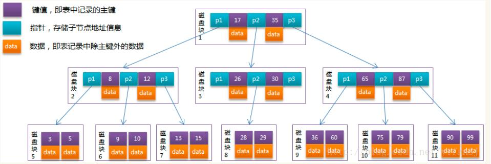
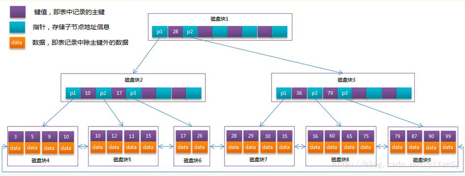

## b树

## b+树

b树是多路平衡查找树，b+树时加强版的多路平衡查找树。

为什么用b+树呢？

1. 全部遍历O(n)
2. hash，增删改查速度快，范围查找速度慢
3. 二叉搜索树，退化成链表
4. 平衡二叉树，数据越大，树越高，树高导致磁盘io增加
5. b树，每个节点有多个数据，可以控制树高，索引文件也非常大，一次加载一个磁盘页，innodb的磁盘页大小为16kb，速度优于二叉搜索树，但不是最优。
6. b+树，数据存放在叶子节点，叶子节点之间有指针指向，提高了范围查询的效率。非叶子节点只存储键值信息。

**实际生产中b+树一般高度不超过3层**

在 MySQL 中我们的 InnoDB 页的大小默认是 16k，假设一行数据的大小是 1k，那么一个页可以存放 16 行这样的数据。

高度为2的b+树的记录数 = 根节点指针数 * 单个叶子节点记录行数。

假设主键 ID 为 bigint 类型，长度为 8 字节，而指针大小在 InnoDB 源码中设置为 6 字节，这样一共 14 字节，我们一个页中能存放多少这样的单元，其实就代表有多少指针，即 16384/14=1170。

高度为 2 的 B+ 树，能存放 1170*16=18720 条这样的数据记录。

高度为 3 的 B+ 树可以存放： 1170*1170*16=21902400 条这样的记录。

所以在 InnoDB 中 B+ 树高度一般为 1-3 层，它就能满足千万级的数据存储