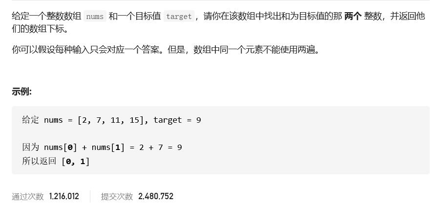

## 哈希函数

- 直接定址法 $f(key)=a×key+b$

- 除留取余法 $f(key)=keymodp(p≤m)$

- 数字分析法，手机号的后四位

- 折叠法

  把关键词分割成位数相同的几个部分，然后叠加

- 平方取中法

  

## 哈希碰撞

- 开发地址法
  - 线性探测法 
  - 平方探测法

- 再散列法

- 链地址法(也称拉链法)

## 自定义数据类型

自定义的数据类型，需要提供**比较函数**和**哈希函数**。

```cpp
#include <unordered_map>
#include <iostream>
using namespace std;

struct ac{
    int a, b;
    // 比较函数
    bool operator == (const ac& t) const{
        return a == t.a && b == t.b;
    }

};

struct hash_func{
    // 哈希函数
    std::size_t operator()(const ac &key) const{
        return std::hash<int>()(key.a*key.b);
    }
};

unordered_map<ac, int, hash_func> mp;
```


```cpp
#include <unordered_map>
#include <iostream>
using namespace std;

class Person{
public:
    int age;
    string name;

    Person(int age_, string name_) {
        age = age_;
        name = name_;
    }

    bool operator == (const Person& t) const {
        return age == t.age && name == t.name;
    }
};

struct hash_func{
    // 哈希函数
    std::size_t operator()(const Person &key) const{
        return std::hash<string>()(key.name) ^ hash<int>() (key.age);
    }
};


int main() {

    unordered_map<Person, int, hash_func> mp;

    Person b {11, "alice"};
    Person a {10, "bob"};

    // 插入数据
    mp[b] = 2;
    mp.insert(pair<Person, int>(a, 1));

    cout << mp.size() << endl;
    cout << mp[b] << endl;

    // 遍历哈希表
    for (auto it : mp) {
        cout << it.first.name << endl;
        cout << mp[it.first] << endl;
    }

    return 0;
}
```


## unordered_multimap

```cpp
#include <unordered_map>
#include <iostream>
using namespace std;

class Person{
public:
    int age;
    string name;

    Person(int age_, string name_) {
        age = age_;
        name = name_;
    }

    bool operator == (const Person& t) const {
        return age == t.age && name == t.name;
    }
};

struct hash_func{
    // 哈希函数
    std::size_t operator()(const Person &key) const{
        return std::hash<string>()(key.name) ^ hash<int>() (key.age);
    }
};


int main() {

    unordered_multimap<Person, int, hash_func> mp;

    Person a {10, "bob"};
    Person b {11, "alice"};
    Person c {11, "alice"};

    mp.insert(pair<Person, int>(a, 1));
    mp.insert(pair<Person, int>(b, 2));
    mp.insert(pair<Person, int>(c, 3));

    cout << mp.size() << endl;
    cout << mp.count(c) << endl;

    typedef unordered_multimap<Person, int, hash_func> myhash;
    pair<myhash::iterator, myhash::iterator> range;
	range = mp.equal_range(b);

    for (auto it = range.first; it != range.second; ++it) {
        cout << it->first.name << " " << it->second << endl;
    }

    // 遍历哈希表
    for (auto it : mp) {
        cout << it.first.name << " " << it.second << endl;
        // cout << mp[it.first] << endl;
    }

    return 0;
}
```


## 两数之和

[题目链接](https://leetcode-cn.com/problems/two-sum/)




```cpp
class Solution {
public:
    vector<vector<int>> threeSum(vector<int>& nums) {
        vector<vector<int>> ans;
        sort(nums.begin(), nums.end());

        unordered_map<int, int> mp;
        for (int &it : nums) {
            mp[it]++;
        }
        for (int i = 0; i < nums.size(); ++i) {
            if (i > 0 && nums[i] == nums[i-1]) continue;
            for (int j = i+1; j < nums.size(); ++j) {
                int d = -nums[i] - nums[j];
                if (d < nums[j]) continue;
                if (mp.find(d) == mp.end()) continue;
                if (nums[i] == nums[j] && nums[i] == d && mp[d] < 3) continue;
                if (nums[j] == d && mp[d] < 2) continue;
                if (!ans.empty() && ans.back()[0] == nums[i] &&
                         ans.back()[1] == nums[j] && 
                         ans.back()[2] == d) continue;
                ans.push_back({nums[i], nums[j], d});  
            }
        }
        return ans;
    }
};
```

