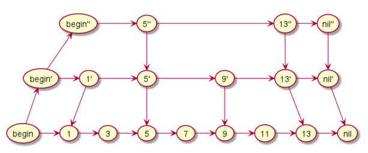

跳表思想和二分类似，普通链表查询的复杂度是$O(n)$，跳表另外建立了索引逐层的查找效率高些。
跳表每层建立的索引没有严格按照二分的要求，即每层减少一般，它是采用一种随机的方式，当插入一个数据时随机的确定他的层数，每次随机的概率时0.5。理论上和二分的效率相同。




```cpp
struct Node{
    int val, level;
    Node* levels[16];
};

class SkipList{
private:
    int MAX_LEVEL = 16;
    int curLevel = 1;
    Node *head = new Node();

public:
    Node* find(int val) {
        Node *p = head;
        for (int i = curLevel-1; i >= 0; --i) {
            while (p->levels[i] && p->levels[i]->val < val) {
                p = p->levels[i];
            }
        }
        if (p->levels[0] && p->levels[0]->val == val) {
            return p->levels[0];
        } else {
            return nullptr;
        }
    }

    void insert(int val) {
        int level = randomLevel();
        Node* newNode = new Node();
        newNode->val = val;
        newNode->level = level;
        Node* update[MAX_LEVEL];
        for (int i = MAX_LEVEL-1; i >= 0; --i) {
            update[i] = head;
        }

        Node* p = head;
        for (int i = level-1; i >= 0; --i) {
            while (p->levels[i] && p->levels[i]->val < val) {
                p = p->levels[i];
            }
            update[i] = p;
        }
        if (p->levels[0] && p->levels[0]->val == val) return;

        for (int i = level-1; i >= 0; --i) {
            newNode->levels[i] = update[i]->levels[i];
            update[i]->levels[i] = newNode;
        }

        curLevel = max(curLevel, level);
    }

    void remove(int val) {
        Node* update[MAX_LEVEL];
        Node* p = head;
        for (int i = curLevel-1; i >= 0; --i) {
            while (p->levels[i] && p->levels[i]->val < val) {
                p = p->levels[i];
            }
            update[i] = p;
        }
        if (!(p->levels[0]) || p->levels[0]->val != val) return;
        for (int i = curLevel-1; i >= 0; --i) {
            Node* tmp = update[i]->levels[i];
            if (tmp && tmp->val == val) {
                update[i]->levels[i] = tmp->levels[i];
            }
        }
    }

    int randomLevel() {
        int ret = 1;
        while (rand() % 2 && ret <= MAX_LEVEL) {
            ret++;
        }
        return ret;
    }
};
```

```cpp
#include <bits/stdc++.h>
using namespace std;
int main() {

    srand(time(0));

    SkipList sl;

    for (int i = 1; i <= 10; ++i) {
        sl.insert(i);
    }
    // cout << "levels: " << sl.curLevel << endl;
    cout << "------------------------" << endl;
    for (int i = 1; i <= 15; ++i) {
        Node* tmp = sl.find(i);
        cout << i << ": " << (tmp ? tmp->val : -1) << endl;
    }
    cout << "------------------------" << endl;

    sl.remove(3);
    sl.remove(5);
    sl.remove(6);
    for (int i = 1; i <= 15; ++i) {
        Node* tmp = sl.find(i);
        cout << i << ": " << (tmp ? tmp->val : -1) << endl;
    }

    return 0;
}
```